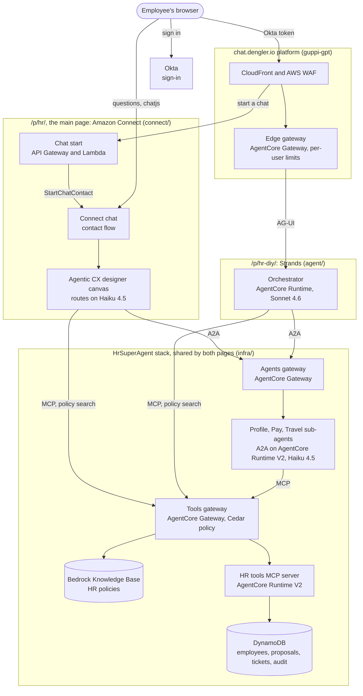

# guppi-hr

An MVP of an HR employee assistant, shown on the page as "HR Assistant", live at
`https://chat.dengler.io/p/hr-diy/`. An orchestrator on Amazon Bedrock AgentCore Runtime
routes each turn to a Profile, Pay, or Travel sub-agent over A2A, or answers general
questions from an HR policy knowledge base; sub-agents act on the employee's own records
through an HR tools MCP server, and every change is proposed, read back, and committed
only after the employee says yes. All employee data and policies are synthetic.

It began as an iteration of guppi-gpt, merged in with its history and renamed (D9). Since
phase 8 it is an agent project on the chat.dengler.io platform that guppi-gpt became
([guppi-gpt `docs/proposals/platform.md`](https://github.com/samdengler/guppi-gpt/blob/main/docs/proposals/platform.md)): the platform owns the page, Okta sign-in (D46),
CloudFront, WAF, the edge gateway and its per-user limits, and this repository owns
everything that is HR (D34). [`docs/design.md`](docs/design.md) describes the system as
built; [`docs/demo.md`](docs/demo.md) walks the four scenarios.

The repository holds two super-agents over the same sub-agents, tools and gateways. The
Strands orchestrator described here serves `/p/hr-diy/`. [`connect/`](connect/) puts Amazon
Connect's Agentic CX designer in the orchestrator's place and serves the main page,
`https://chat.dengler.io/p/hr/`; its README covers that side. The four scenarios run on
both pages. Until 3 October 2026 the Strands page was `/p/hr/` and the Connect page
`/p/hr-connect/` (D37). The repository was named hr-super-agent until 2 October 2026, when
guppi-connect moved in as `connect/`.

## Architecture



Both pages run the same four scenarios over the same sub-agents, gateways and tools, so the
two super-agents can be compared turn by turn. Every hop carries a token that names the
employee: AgentCore Identity exchanges the Okta token for a hop token at each step (RFC 8693,
D47), and the tools gateway's Cedar policy decides each tool call on the token's scopes. On
`/p/hr/` the chat start function makes the first exchanges and starts the Connect contact;
the page then sends each question to Connect itself. An AG-UI bridge runtime on the edge
gateway (`?ff=connect-bridge`) is the fallback path. The sign-in to first answer sequence is
in [`docs/hr-page-sequence.md`](docs/hr-page-sequence.md). The sub-agent and tools runtimes
run on AgentCore Runtime V2; [`docs/handoff-runtime-v2.md`](docs/handoff-runtime-v2.md) has
the V1 and V2 measurements.

## What it does

- **Routing.** A Sonnet 4.6 routing step names an area, a confidence band, and the
  alternatives; code decides whether to delegate, answer, or ask one clarifying question.
  Follow-ups stay with the active area; a clear topic shift re-routes.
- **Sub-agents.** Profile (home address, emergency contact), Pay (direct deposit, pay
  statements), and Travel (pass travel policy, read-only) run as separate A2A servers
  behind their own AgentCore Gateway, each on Haiku 4.5.
- **Confirmation before writes.** Every change is a propose tool, the exact change read
  back, and a `commit_change` that only a confirmed, unexpired proposal from the same user
  and conversation passes. The commit writes an audit entry with the turn's trace id.
- **Escalation.** Asking for a person opens an HR ticket with an id.
- **The page.** The platform's plain text page, with this project's extension
  (`web/src/ext.js`): a status line per tool call and per delegation ("Asking the Pay
  agent..."), the answering agent on each reply label, and the AG-UI state round trip
  that lets a "yes" commit the proposed change.

## What the stack holds

`HrSuperAgent` holds the orchestrator runtime and its target `hr` on the platform's edge
gateway, the three sub-agent runtimes and their agents gateway, the HR tools server and
its four DynamoDB tables, the tools gateway with the knowledge base (its content bucket and
nightly ingestion) and the HR tools target, the conversation log, alarms and vended log
delivery for those resources, and the Dynatrace trace and log export. Every JWT authorizer
accepts the platform user pool's token. The stack reads the platform's identifiers from
`/guppi/platform/*` SSM parameters at deploy time.

## Documentation

| Document | Contents |
| --- | --- |
| [`docs/design.md`](docs/design.md) | Components, one turn end to end through the platform, routing policy, confirmation, identity per hop, tools, observability, limits |
| [`docs/hr-page-sequence.md`](docs/hr-page-sequence.md) | `/p/hr/` from sign-in through the warm start to an answer, as sequence diagrams, with one turn's timeline from the logs |
| [`docs/demo.md`](docs/demo.md) | The four scenarios, what to type and what to expect, and how to check the logs and audit entries |
| [`docs/decision-log.md`](docs/decision-log.md) | Every decision, D1 on, with status |
| [`docs/aws-feedback.md`](docs/aws-feedback.md) | What the POC learned about AWS services (trace context first), with evidence and asks, for the AWS teams |
| [`docs/latency-log.md`](docs/latency-log.md) | Every latency measurement, L1 on, with what changed and the result |
| [`docs/handoff-runtime-v2.md`](docs/handoff-runtime-v2.md) | AgentCore Runtime V2 against V1: first-answer times, the cold start study's results, what is deployed |
| [`docs/runtime-v2-research.md`](docs/runtime-v2-research.md), [`docs/runtime-v2-experiments.md`](docs/runtime-v2-experiments.md) | The Runtime V2 cold start research and the experiment plan (E1 to E15); evidence in [`docs/runtime-v2-evidence/`](docs/runtime-v2-evidence/) |
| [`docs/plan.md`](docs/plan.md) | The phases (all done), the four scenarios, the first-cut routing policy |
| [`docs/phase-8.md`](docs/phase-8.md), [`docs/phase-8-report.md`](docs/phase-8-report.md) | The move onto the platform and its report |
| [`docs/handoff.md`](docs/handoff.md) | The brief this repository started from, and its sources |
| [`docs/proposals/`](docs/proposals/) | Proposals: on-behalf-of token exchange, conversation logging, traceability, Dynatrace, Touchpoint alignment, Connect chatjs, and others |

The Amazon Connect super-agent's documents, in [`connect/`](connect/README.md):

| Document | Contents |
| --- | --- |
| [`connect/docs/connect-super-agent.md`](connect/docs/connect-super-agent.md) | The first analysis: Connect's options for an orchestrating agent, four ways to put Connect in front, a comparison with the custom super-agent and ASAPP, gaps, pricing |
| [`connect/docs/acxd-super-agent.md`](connect/docs/acxd-super-agent.md) | The design `connect/` built: the designer canvas as the super-agent over the existing sub-agents and tools, with the spike's results |
| [`connect/docs/spike-report.md`](connect/docs/spike-report.md) | What the spike proved over Connect chat, with real and mock sub-agents |
| [`connect/docs/platform-plan.md`](connect/docs/platform-plan.md), [`connect/docs/platform-report.md`](connect/docs/platform-report.md) | How the Connect project joined chat.dengler.io, and its report |
| [`connect/docs/latency-plan.md`](connect/docs/latency-plan.md) | Where a `/p/hr/` turn's time goes, hop by hop, and the changes that cut it |

guppi-gpt's documents as they were at the fork, for the platform underneath:

| Document | Contents |
| --- | --- |
| [`docs/guppigpt-design.md`](docs/guppigpt-design.md) | The single page chat's design: requirements, architecture, wire format, agent, security, observability |
| [`docs/guppigpt-architecture.md`](docs/guppigpt-architecture.md) | The runtime and content flow diagrams |
| [`docs/guppigpt-decision-log.md`](docs/guppigpt-decision-log.md) | How that design reached its shape: revisions and reversed decisions |

The `.html` files beside the Markdown copies are the originals, for a browser; the live
platform's documents are in guppi-gpt.

## Layout

| Path | Contents |
| --- | --- |
| `agent/` | One container image for every runtime; `AGENT_ROLE` picks orchestrator, tools, profile, pay, or travel. The orchestrator's HTTP surface is the platform kit, `guppi-agent` at `kit-v0.2.0` |
| `infra/` | AWS CDK app (Python), one stack `HrSuperAgent` |
| `web/` | `manifest.json` (the project on the platform) and the extension, `src/ext.js`, bundled to `dist/ext.js` |
| `content/hr/` | The synthetic HR policy documents the knowledge base indexes |
| `evals/` | 60 labeled routing utterances and the offline routing evaluation |
| `scripts/` | `deploy.sh`, `seed-content.sh`, `ingest.sh`, `browser-check.mjs` |
| `connect/` | The Amazon Connect super-agent: the designer canvas as code, its contact flow, the AG-UI bridge and its own stack `GuppiConnect` |

## Prerequisites

- AWS credentials for the account that holds guppi-gpt's `GuppiGpt` platform stack,
  region `us-east-1`, with Bedrock access to Claude Sonnet 4.6 and Haiku 4.5 through the
  `us.` inference profiles; the platform publishes `/guppi/platform/*` there
- [uv](https://docs.astral.sh/uv/), Node 22 or later, a Docker daemon for the arm64 image
  build (Colima works; `colima start` first), `jq`, and the AWS CLI
- The GitHub CLI signed in with read access to `samdengler/guppi-gpt`: the image installs
  the private kit with a token from `gh auth token` (D29); `HR_GITHUB_TOKEN` overrides it
- Optionally the [1Password CLI](https://developer.1password.com/docs/cli/) with
  `GuppiGPT Dynatrace` in the `Personal` vault, which turns on Dynatrace export

## First deploy and demo

```sh
uv sync --all-packages --dev   # install everything
uv run -- pytest               # agent and stack tests, no AWS needed
(cd web && npm ci && npm test) # extension and manifest tests
scripts/deploy.sh              # image, stack, manifest and extension
scripts/seed-content.sh        # sync content/hr/ to the knowledge base bucket
scripts/ingest.sh              # index it and wait
```

Then open `https://chat.dengler.io/p/hr-diy/`, sign in, and follow [`docs/demo.md`](docs/demo.md).

## Everyday commands

```sh
scripts/deploy.sh --reuse-parameters     # skip 1Password, reuse the stack's Dynatrace values
scripts/deploy.sh --require-approval never  # no terminal to answer cdk's IAM prompt
scripts/deploy.sh --site-only            # publish the manifest and extension only
uv run python evals/route.py             # routing accuracy against Bedrock, about 35 seconds
uv run -- ruff check .
```

Every deploy is logged to `.deploy/deploy-<timestamp>.log`, with `.deploy/latest.log`
pointing at the newest and a final `deploy exit=<code>` line. Flipping a feature flag for
this project is an edit to `features` in `web/manifest.json` and
`scripts/deploy.sh --site-only`.

## Status

All phases of [`docs/plan.md`](docs/plan.md) are deployed; phase 8 moved the project onto
the platform on 2 Oct 2026 ([report](docs/phase-8-report.md)). The routing evaluation
scores 60 of 60 on its own corpus (58 of 60 before D28). Notes:

- Waiting for review as Proposed: D24 to D33 from phases 3 to 8, and D1 to D3, D5 to D7,
  and D11 to D14 from the original brief, which the build followed.
- Transaction Search belongs to `GuppiGpt`; `-c own_account_singletons=true` makes this
  stack create it in an account without that stack (D16).
- No alarm email is subscribed; set `HR_ALARM_EMAIL` on a deploy to add one.
- The platform's edge gateway refuses any message containing a localhost or loopback URL;
  because the page resends the thread, New chat is the way out.
- On-behalf-of token exchange between agents and tools is the Delta version's identity
  model on PingFederate (D20).
