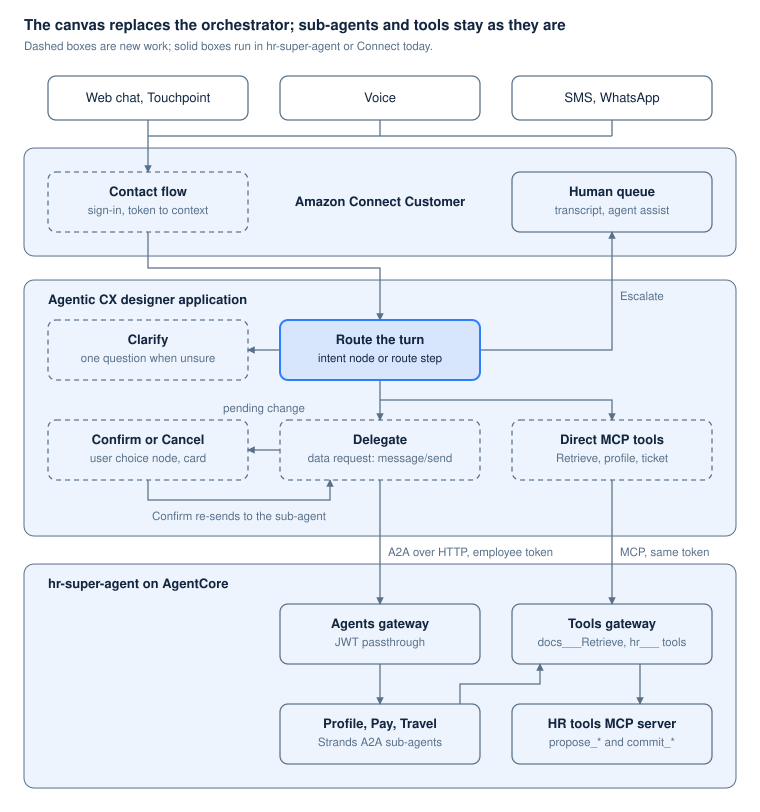

# Agentic CX designer as the HR super-agent

> Markdown copy of [`acxd-super-agent.html`](acxd-super-agent.html), made on 6 October 2026 for reading on GitHub. The HTML file is the original. The diagram is a standalone SVG copy in `docs/figures/`.

*1 October 2026 · Sam Dengler*

> Copied on 2 October 2026 from the Claude Doc of the same name, which is private. It reads as it stood that day; where it and the code disagree, the code and `docs/spike-report.md` and `docs/platform-plan.md` are current.

## Summary

An Agentic CX designer application in Amazon Connect Customer can replace the Strands orchestrator in hr-super-agent, while the Profile, Pay and Travel A2A sub-agents, both AgentCore gateways and the HR tools MCP server stay as built. Recommendation: spike it in guppi-connect against hr-super-agent's four scenarios and 60-utterance routing eval before committing.

The design rests on one fact from the code. A delegation today is a single HTTP POST of A2A `message/send` to the agents gateway, with the employee's token as the bearer (`orchestrator.py`, `send_to_sub_agent`). A designer data request can send the same POST. The canvas can also call the tools gateway over MCP with the same headers the orchestrator sends today. Your rule for tools and sub-agents carries over unchanged: steps the canvas decides are MCP tool calls, and steps that need domain judgment go to a sub-agent.

What Connect adds: voice, chat and messaging channels, escalation to a person with the transcript, and a canvas where routing and confirmation are fixed steps. After the spike, what is still open:

- The designer's MCP data request type, which failed before sending even with a real token. A plain HTTP JSON-RPC `tools/call` works in its place; Sync in the console may fix the native type.
- Routing at 58 of 60: the canvas scored 55, with two of the misses being escalations to a person.
- Voice: the spike tested chat only; the instance has no phone number.

The [Agentic CX designer](https://docs.aws.amazon.com/connect/latest/adminguide/acxd.html) came from AWS's [acquisition of NLX](https://aws.amazon.com/blogs/contact-center/amazon-connect-deploy-conversational-ai-in-weeks-not-months/) on 23 April 2026 and has been generally available in 9 Regions, including us-east-1, since 2 September 2026. The wider comparison with Connect's orchestration AI agent and ASAPP is in [Amazon Connect as the GUPPI super-agent](connect-super-agent.md).

## Spike results, 2 October

The design works end to end against hr-super-agent's real sub-agents and tools gateway with a real employee token, built entirely from code: the designer has an SDK, so the earlier "console only" finding was wrong. It ran overnight against mock sub-agents and on the morning of 2 October against the real ones. Still open: the designer's own MCP data request type, and routing at 55 of 60. Details, commands and evidence are in `docs/spike-report.md` in guppi-connect (branch `spike/acxd`).

| Question | Result |
| --- | --- |
| Real sub-agents with a real token | Pass. The Profile agent proposed from the employee's actual record, committed on "yes" through the confirmation step and answered the follow-up; Pay listed real pay statements; Travel answered from policy; escalation reached the Connect queue |
| Employee token in data request headers | Works. A Connect contact attribute becomes a context variable, and `Authorization: Bearer {hrToken:NLX.Context}` declared on the data request reaches both gateways and every sub-agent. Headers set only on the flow node are not sent |
| A2A `message/send` from the canvas | Works as a JSON string template payload: nested placeholders filled, quotes escaped. A field-map payload fills only top-level fields |
| Reading the nested A2A reply | Works with dot paths, `{DelegateProfile.result.parts.0.text:NLX.Variable}` and `...parts.1.data.pendingAction.proposalId` |
| Recent turns for the sub-agent | Works from two context variables set at each reply (last utterance, last reply) |
| Fixed confirmation | Works: only the confirmation step's "yes" branch sends the pending change, so nothing commits without it |
| Data request timeout | A node caps at 30 seconds. Real sub-agent turns took 3.6 to 10.3 seconds, the commit being the slowest |
| Routing eval | 55 of 60, weighted 84 of 91 (92%), after one tuning round from a 45 of 60 baseline. Two of the five misses are deliberate escalations to a person |
| Models | Nova Micro, Nova 2 Lite, Claude Haiku 4.5, Claude Sonnet 5, per node |
| MCP from the canvas | A plain HTTP data request that posts JSON-RPC `tools/call docs___Retrieve` works: 200 in 725 ms with plain JSON, and the policy answer cited the PTO policy. The designer's MCP data request type fails every call before sending ("data request could not be prepared"), with a real token too; the console's Sync step is the likely missing piece |
| Deployment from code | `amazon-connect-acxd-sdk` 0.2.0 creates and deploys everything; the deployment's `deploymentAlias` binds the Connect contact flow. Only the first API key needs the console |
| Canvas overhead | About 0.5 seconds per delegated turn on top of the sub-agent |

## Architecture

The contact flow signs the employee in and hands the conversation to the canvas. The canvas routes each turn and either clarifies, delegates to a sub-agent over A2A, or calls an MCP tool itself, and escalates to a person when no domain fits.

*Agentic CX designer over the hr-super-agent sub-agents and tools*

Everything inside hr-super-agent on AgentCore is the stack as built today; the new work is the contact flow and the canvas.

## The orchestrator's steps as canvas nodes

Each step `orchestrator.py` runs today has a canvas equivalent, and the routing step can stay as code if the canvas version scores worse.

| Orchestrator step today | Decision | Canvas equivalent |
| --- | --- | --- |
| Route the turn: one Sonnet 4.6 call forced to a `route` tool returning domain, confidence band, alternatives and a follow-up flag | D26 | Option 1: an intent classification node with an AI description per domain. Option 2: the existing routing step exposed over HTTP and called by a data request node, which keeps today's 60 of 60 baseline and the router's model |
| Apply the policy: a follow-up or a reply to a pending change stays in the active domain; high band delegates; medium delegates only inside the active domain or when no alternative exists; otherwise clarify | D28 | Split nodes over `activeDomain`, `pendingAction` and the band |
| Ask one clarifying question naming the two leading candidates | D26 | A message or user choice node built from the alternatives |
| Delegate: A2A `message/send` to the domain's sub-agent with the token, recent turns and the pending change | D27 | A data request node per domain, or one node with the domain in the URL (see the next section) |
| Carry `activeDomain` and `pendingAction` between turns in AG-UI state | D6, D23 | Canvas variables that persist across turns within the contact |
| Confirm a write: the sub-agent proposes, the next affirmative turn commits | D7 | When the reply carries a pending change, a user choice node asks Confirm or Cancel; Confirm sends the affirmation and the proposal back to the same sub-agent, which calls `commit_change` |
| Answer a general policy question with the knowledge base agent | D27 | `docs___Retrieve` as an MCP call (see MCP tools below) |
| Offer a ticket when no domain fits or a sub-agent fails | D14 | The Escalate branch to a Connect queue with the transcript, or `open_ticket` over MCP |
| Log domain, band, alternatives, delegated_to and confirmed per run | Phase 4 | Analytics tags on the routing and confirmation nodes; the designer's transcripts and dashboards |

## A2A delegation as a data request

The canvas reaches each sub-agent with an External [data request](https://docs.aws.amazon.com/connect/latest/adminguide/acxd-data-requests.html) that sends what `send_to_sub_agent` sends today. The sub-agents, the agents gateway and its JWT passthrough do not change.

| Part of the call | Today in `send_to_sub_agent` | In the data request |
| --- | --- | --- |
| Method and URL | `POST {agents gateway}/{domain}/invocations` | One data request per domain, or one with the domain as a URL parameter |
| `Authorization` | `Bearer {user token}` | Dynamic header from the token context variable, or a Secret for a fixed value |
| `X-Amzn-Bedrock-AgentCore-Runtime-Session-Id` | `{thread id}-{domain}`, padded to 33 characters | Dynamic header built from the conversation ID and the domain |
| JSON-RPC envelope | `jsonrpc`, `id`, `method: message/send` | Request model with fixed values |
| `message.parts[0].text` | The user's message | `{System.utterance}` |
| `message.contextId` | The thread ID | The conversation ID, so the sub-agent and the tools see one thread |
| `message.metadata.history` | Recent turns | Needs a transcript variable; not documented (see below) |
| `message.metadata.pending` | The pending change | `{pendingAction}` |
| Response | Text parts joined; a data part with the pending change, `committed` and `error` | Response model over `result.parts`; a Transform node splits the text and the data part into variables |
| Timeout | 120 seconds | Not documented; the node has failure and timeout paths |

The sub-agents keep no state between calls and read recent turns from `metadata.history`. If the canvas cannot supply the transcript, two fixes fit the current design: the sub-agents read history from AgentCore Memory keyed by the contextId, or the canvas keeps a short rolling transcript in a variable.

The A2A contract is plain `message/send` over HTTP, so nothing here depends on Connect's own A2A feature. That feature uses a WebSocket, Connect extension events and a static API key, and the designer does not use it.

## MCP tools the canvas calls directly

The canvas calls the tools gateway over MCP for steps it decides itself, and leaves every write to the sub-agents. AWS's [GA blog](https://aws.amazon.com/blogs/contact-center/blend-structured-business-logic-with-agentic-ai/) names AgentCore Gateway as an MCP endpoint the designer calls directly, with no Lambda in between.

| Capability | Called as | From the canvas | Why this side of the rule |
| --- | --- | --- | --- |
| Policy questions | `docs___Retrieve` (MCP) | Policy answer step | Retrieval with no domain judgment |
| Who is asking | `get_profile` (MCP) | Start of the session, to greet and prefill | A lookup the canvas decides to make |
| Pay statements | `list_pay_statements` (MCP), or the Pay sub-agent | Either | Read-only; judgment only when the question is open-ended |
| Ticket when no domain fits | `open_ticket` (MCP), or a Connect case | Escalate branch | A fixed step |
| Address, emergency contact, direct deposit changes | Profile and Pay sub-agents (A2A), which call `propose_*` and `commit_change` | Delegate step | Judgment about which record and what changed |
| Pass travel and flight benefits | Travel sub-agent (A2A) | Delegate step | Judgment over policy text |

How the canvas connects:

- **One registration.** An MCP data request points at the tools gateway URL. Sync lists the gateway's tools, and only four are enabled: `docs___Retrieve`, `get_profile`, `list_pay_statements` and `open_ticket`. `propose_*` and `commit_change` stay disabled, so the canvas cannot write.
- **Headers as today (D19).** `Authorization: Bearer {token}` for the gateway, `X-Hr-User-Token: {token}` for the HR tools server, which verifies it itself, and `X-Hr-Thread-Id: {conversation ID}`. The sub-agents use the same conversation ID as their A2A contextId, so a proposal stays bound to one conversation whichever side calls.
- **Where it runs.** As a tool on a [Generative Journey](https://docs.aws.amazon.com/connect/latest/adminguide/acxd-generative-journey.html) node, the model picks the call. As a fixed call from a data request node, the canvas picks it; the docs show this for HTTP requests and do not say whether a data request node can name one MCP tool.

What changes from the orchestrator's MCP use:

- The tool list is synced when the data request is configured. A new gateway tool needs a re-sync and a new build; nothing is listed at run time.
- MCP Apps resources (`ui://`, `structuredContent`) are not rendered. Cards come from designer modalities.
- The MCP protocol version and the per-call timeout are not documented.

## Employee identity from sign-in to the HR tools

If the token reaches the data request headers, every hop below the canvas carries the employee's own token exactly as it does today, and nothing in the gateways or tools changes. That is the first thing the spike tests.

1. **Sign-in.** The chat entry authenticates the employee: Connect's customer authentication or pre-chat authentication on the web widget, or Touchpoint with a token from the existing Cognito pool. The token and the employee ID are set as contact attributes.
2. **Into the canvas.** The [Agentic CX block](https://docs.aws.amazon.com/connect/latest/adminguide/agentic-cx-block.html) maps contact attributes to context variables, at most 10 per block. The variables must already exist in the designer with matching names.
3. **Into each call.** Data requests take dynamic headers and can send context variables. The docs show context variables in payloads and dynamic headers that "may change based on the flow, environment, or context", but no example of a header built from one.
4. **Below the canvas, unchanged.** The agents gateway checks the JWT and passes it to the sub-agent; the sub-agent calls the tools gateway with it; the HR tools server verifies `X-Hr-User-Token` before using the subject (D19).

Two points for Delta security. Data request fields can be marked Sensitive to keep them out of designer logs "where supported"; whether that covers a header carrying the token has to be checked. And the Delta version swaps Cognito for PingFederate with per-hop token exchange (D20); the canvas would hold the first token, and the exchange would still happen at the gateways through AgentCore Identity.

If headers cannot carry the token, the fallback is weaker: the canvas sends a verified employee ID, and the tools trust the caller. That would need Delta security's approval and should end the spike if they refuse it.

## What the designer does not do at GA

The gaps below are the ones left after the 2 October spike, which corrected two earlier entries: the designer has an SDK, and its model list is Nova Micro, Nova 2 Lite, Claude Haiku 4.5 and Claude Sonnet 5. The 30-second timeout and the MCP data request would weigh on a Delta production decision.

| Gap | Cost to this design | Workaround |
| --- | --- | --- |
| Data request nodes time out at 30 seconds at most (SDK model) | A long sub-agent turn fails to the canvas's "could not be reached" step | Measure real turns; keep sub-agent turns short or move slow work behind an asynchronous tool |
| The designer's MCP data request failed every call before sending in the spike ("could not be prepared") | Journey tool use over MCP is unproven | A plain HTTP data request posting JSON-RPC `tools/call`, which reaches the gateway; try the console's Sync |
| No documented export of traces or logs to S3, CloudWatch or OpenTelemetry | Dynatrace and the run log lose the orchestrator's view | `QueryLogs` in the SDK returns node-level events one to two minutes after a turn; sub-agents and gateways keep their own telemetry |
| One deployment per application | Development and production need two applications over the same flows | Done in the spike: `hr-assistant` and `hr-assistant-production` |
| The first API key needs the console, and the console needs a Connect user with the Admin profile | One manual step per account | After the key, everything is SDK calls |
| Guardrails are a native rules engine (regex, keyword, LLM judge), not Bedrock Guardrails ([guardrails](https://docs.aws.amazon.com/connect/latest/adminguide/acxd-guardrails.html)) | HR PII masking is written as rules | The sub-agents and tools keep their own checks |
| Cards and other modalities render only through the Touchpoint SDK ([modalities](https://docs.aws.amazon.com/connect/latest/adminguide/acxd-modalities.html)) | The confirmation card needs a Touchpoint frontend; on chat and voice it is a text or spoken confirmation | Confirmation stays enforced by the fixed step either way |
| Knowledge bases take uploads only, no Bedrock Knowledge Base connector ([knowledge bases](https://docs.aws.amazon.com/connect/latest/adminguide/acxd-knowledge-bases.html)) | None here | `docs___Retrieve` over HTTP reaches the existing Bedrock KB |

## Spike plan in guppi-connect

The spike runs against the deployed hr-super-agent stack and changes nothing in it, so any difference in results comes from the canvas. The identity test comes first because the design depends on it.

1. **Instance and entry.** A Connect Customer instance in us-east-1 with the chat widget, and a contact flow that authenticates the employee and passes the token and employee ID to the Agentic CX block. Check: a data request against an echo endpoint receives the token in its Authorization header.
2. **Delegation.** A data request that posts `message/send` to the Profile target on the agents gateway. Check: Profile answers, proposes an address change, and commits it after Confirm on a user choice node, with the audit record carrying the right subject.
3. **Direct MCP tools.** One MCP data request on the tools gateway with the four read and ticket tools enabled and the D19 headers. Check: a policy answer with a citation; `commit_change` is not available to the canvas.
4. **Routing.** An intent node and split nodes over `activeDomain`, then the existing routing step over HTTP as the alternative. Check: the four scenarios, and the 60 labeled utterances against hr-super-agent's 60 of 60.
5. **Latency and limits.** Real sub-agent turns on chat and on voice. Check: the data request timeout, the wait per turn, and whether recent turns reach the sub-agent.
6. **Escalation.** The Escalate branch to a human queue. Check: the agent sees the transcript.

Decision criteria:

- [x] The employee's token reaches the gateways through data request headers (real token, 2 October)
- [ ] Routing scores at least 58 of 60 on the eval set (55 of 60 after one tuning round)
- [x] Sub-agent turns finish inside the 30-second node timeout on chat (3.6 to 10.3 seconds); voice not yet tested
- [x] A promotion path from Development to Production: the SDK deploys each environment from code
- [x] No change needed in the sub-agents, gateways or HR tools server

## Sources

AWS pages opened on 1 October 2026:

1. [Agentic CX designer](https://docs.aws.amazon.com/connect/latest/adminguide/acxd.html), Connect Customer admin guide
2. [Agentic CX block](https://docs.aws.amazon.com/connect/latest/adminguide/agentic-cx-block.html)
3. [Data requests](https://docs.aws.amazon.com/connect/latest/adminguide/acxd-data-requests.html)
4. [Using the Generative Journey agent node](https://docs.aws.amazon.com/connect/latest/adminguide/acxd-generative-journey.html)
5. [Knowledge bases](https://docs.aws.amazon.com/connect/latest/adminguide/acxd-knowledge-bases.html)
6. [Modalities](https://docs.aws.amazon.com/connect/latest/adminguide/acxd-modalities.html)
7. [Guardrails](https://docs.aws.amazon.com/connect/latest/adminguide/acxd-guardrails.html)
8. [Builds and deployments](https://docs.aws.amazon.com/connect/latest/adminguide/acxd-builds-deployments.html)
9. [Using the Live Sync agent node](https://docs.aws.amazon.com/connect/latest/adminguide/acxd-live-sync.html)
10. [Agentic CX designer GA](https://aws.amazon.com/about-aws/whats-new/2026/09/agentic-cx-designer/), What's New, 2 September 2026
11. [Blend structured business logic with agentic AI](https://aws.amazon.com/blogs/contact-center/blend-structured-business-logic-with-agentic-ai/), AWS Contact Center blog, 2 September 2026
12. [Amazon Connect: Deploy conversational AI in weeks, not months](https://aws.amazon.com/blogs/contact-center/amazon-connect-deploy-conversational-ai-in-weeks-not-months/), AWS Contact Center blog, 23 April 2026
13. [Connect Customer pricing appendix](https://aws.amazon.com/products/connect/customer/pricing/appendix/)

Internal:

- [Amazon Connect as the GUPPI super-agent](connect-super-agent.md), the wider comparison
- HR Super Agent MVP: Plan and Handoff (a private Claude Doc), decisions D1 to D28
- hr-super-agent repository: `agent/src/hr_agent/orchestrator.py` (`send_to_sub_agent`), `agent/src/hr_agent/agent.py` (MCP headers), `agent/src/hr_agent/tools/server.py` (HR tools)
