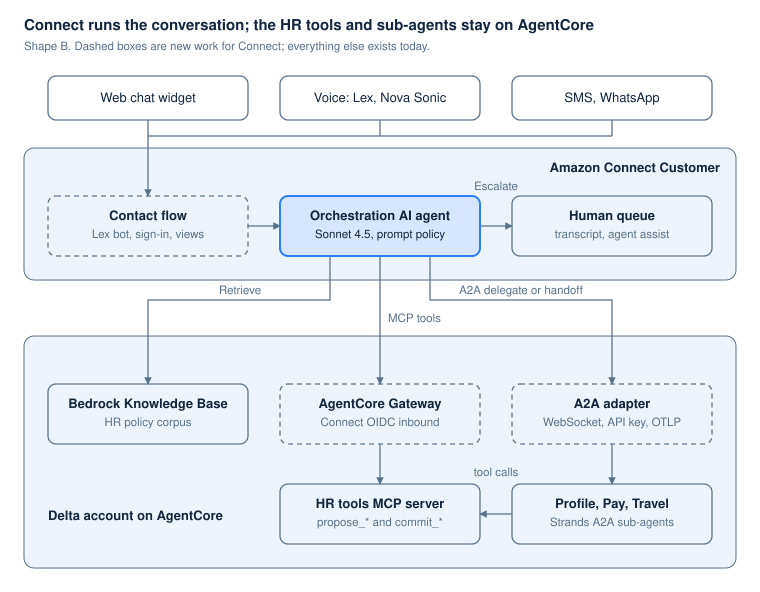
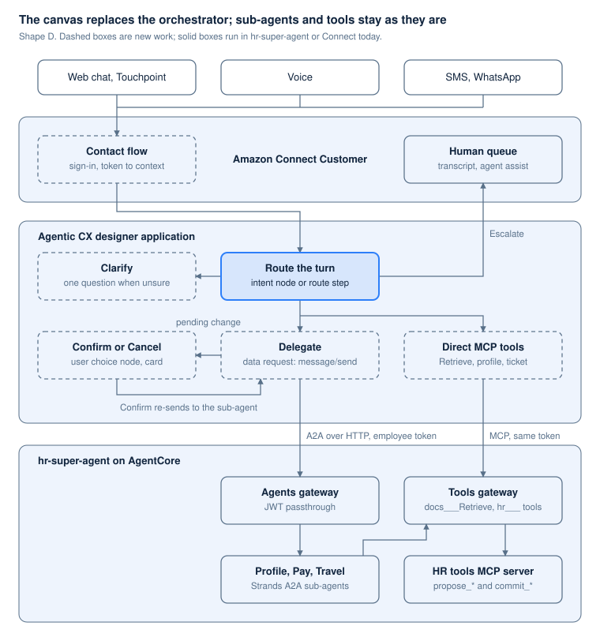

# Amazon Connect as the GUPPI super-agent

> Markdown copy of [`connect-super-agent.html`](connect-super-agent.html), made on 6 October 2026 for reading on GitHub. The HTML file is the original. The diagrams are standalone SVG copies in `docs/figures/`.

*1 October 2026 · Sam Dengler*

> Copied on 2 October 2026 from the Claude Doc of the same name, which is private. It reads as it stood that day; where it and the code disagree, the code and `docs/spike-report.md` and `docs/platform-plan.md` are current.

## Summary and recommendation

The goal is to replace the Strands orchestrator in hr-super-agent with Amazon Connect Customer, while the Profile, Pay and Travel A2A sub-agents and the MCP tools stay as they are. Either Connect builder can do it. Recommendation: spike the Agentic CX designer first (shape D), with the orchestration AI agent (shape B) as the comparison, against hr-super-agent's four scenarios and 60-utterance eval.

Update, 2 October: the overnight spike built shape D from code and ran it over Connect chat. The next morning it passed every scenario against the real sub-agents and tools gateway with a real employee token; routing scored 55 of 60, and the designer's own MCP data request type is the one piece that failed. Results are in [Agentic CX designer as the HR super-agent](acxd-super-agent.md); where this doc and the spike disagree, the spike is newer.

The designer goes first because it can make the call the orchestrator makes today. A delegation in hr-super-agent is one HTTP POST of A2A `message/send` to the agents gateway, with the employee's token as the bearer (`orchestrator.py`, `send_to_sub_agent`). A designer data request can send the same POST with the token in a dynamic header. The sub-agents, both gateways and the identity chain then stay unchanged, routing becomes canvas nodes, and confirmation becomes a fixed step before the commit.

Open questions the spike must answer for shape D:

- Whether a dynamic Authorization header can carry the employee's token in from the contact flow. Headers built from context variables are not documented.
- Whether a data request waits long enough for a sub-agent turn. The orchestrator allows 120 seconds today; the designer documents no data request timeout.
- Whether the canvas can send recent turns to the sub-agent, which holds no state between calls and reads them from `metadata.history` today.
- Which models the routing node can use. No list is published.
- How builds reach production: the designer SDK deploys from code (found in the spike); there is still no CloudFormation support.

Shape B reaches the sub-agents through Connect's own A2A contract: a WebSocket, Connect extension events and a static API key. Every sub-agent needs an adapter, and the employee's token does not reach them. In exchange, B keeps an API for configuration and Connect's A2A tracing.

If both shapes fail on routing or identity, the fallback keeps Connect for channels and handoff and puts the existing orchestrator behind it as a single handoff collaborator (shape A below).

## What GUPPI and the HR super agent already prove

The custom route is built and working: hr-super-agent passed its four conversational scenarios in the browser through phase 7, on the guppi-gpt stack. Any Connect design has to match that bar or replace a piece of it with something cheaper to own.

| Piece | Where it lives | What it does today |
| --- | --- | --- |
| Chat host | guppi-gpt (`chat.dengler.io`) | Plain-text page, Google sign-in through Cognito, AG-UI over SSE, CloudFront and WAF, an edge AgentCore Gateway with per-user rate limits, conversation log in S3 under a pseudonym, feedback to Dynatrace |
| Platform model | guppi-gpt `platform` branch | One host, many projects: a manifest per project under `/p/<name>/`, a tools-only tier (an MCP target the platform agent calls) and an agent tier (a project's own Runtime) |
| MCP Apps host | guppi-gpt phase 3 | Renders `ui://` resources from tool results in a sandboxed iframe; cards, charts and forms work, tool calls from the app and model-context updates are still refused |
| MCP Apps provider | guppi-mcp-app | An MCP server on AgentCore Runtime behind the tools gateway; experiments E1 to E6 found which MCP Apps features the host and gateway support |
| Super agent | hr-super-agent | A Strands orchestrator on Sonnet 4.6 that routes each turn to Profile, Pay or Travel A2A sub-agents on Haiku 4.5, asks one clarifying question below a confidence threshold, keeps the active domain in AG-UI state, and commits writes only through `propose_*` and `commit_*` tool pairs with an audit record |
| Routing evaluation | hr-super-agent `evals/` | 60 labeled utterances; 60 of 60 routed correctly after the D28 threshold change |

The ASAPP vs AWS AgentCore analysis (a private Claude Doc) set the split: AWS covers the runtime, gateway, identity, memory and telemetry (Buy), while the conversational policy layer, the chat client, human handoff and business reporting stay Build. Indu's comparison (a private Claude Doc) frames the same gap as infrastructure (AgentCore) against an application (ASAPP, Decagon) that ships channels, agent assist, QA and handoff. Amazon Connect is the AWS product on the application side of that line, which is why it belongs in this comparison.

Neither repo mentions Amazon Connect today. The identity work that matters for Delta (PingFederate on-behalf-of exchange per hop) is proven at Delta and stubbed with Cognito passthrough in the MVP (D19, D20).

## What Amazon Connect Customer offers an orchestrating agent

Since re:Invent 2025 and the 22 September 2026 A2A launch, a Connect orchestration AI agent can do most of what the hr-super-agent orchestrator does: call MCP tools, call other agents, retrieve from knowledge bases, and escalate to a person. Amazon Connect was renamed Amazon Connect Customer on 28 April 2026; the API is still `qconnect`, and "Amazon Q in Connect" is now Connect AI agents.

| Capability | What Connect Customer provides | Limit that matters for GUPPI |
| --- | --- | --- |
| Orchestrator | An orchestration AI agent built from a YAML prompt, one guardrail, tools and a locale, published as immutable versions ([AI agents](https://docs.aws.amazon.com/connect/latest/adminguide/create-ai-agents.html)) | Policy lives in the prompt; there is no hook to run code before or after the model, so D26's forced routing step and code-enforced threshold have no direct home |
| Models | Fixed list per Region; in us-east-1 the newest listed for custom prompts are Claude Sonnet 4.5 and Haiku 4.5, with Nova and gpt-oss ([AI prompts](https://docs.aws.amazon.com/connect/latest/adminguide/create-ai-prompts.html)) | No bring-your-own model. Sonnet 4.6 is named in a prefill note but missing from the supported table; Sonnet 5 and Opus are absent |
| MCP tools | Out-of-the-box Connect tools (Cases, Customer Profiles, Tasks), flow modules saved as tools, and third-party tools through one AgentCore Gateway per MCP server ([MCP tools](https://docs.aws.amazon.com/connect/latest/adminguide/ai-agent-mcp-tools.html)) | Gateway inbound auth must use the Connect instance's OIDC discovery URL; MCP version `2025-03-26`; 30 second timeout per tool call ([gateway setup](https://docs.aws.amazon.com/connect/latest/adminguide/3p-apps-mcp-server.html)) |
| Return to Control | `Complete`, `Escalate` and custom tools hand the turn back to the contact flow with the tool's inputs as attributes ([agentic self-service](https://docs.aws.amazon.com/connect/latest/adminguide/agentic-self-service.html)) | The flow can then run Lambda, show a view, or queue to a person, and return to the agent |
| Sub-agents (A2A) | `delegateAgentConfiguration` for work behind the scenes, `handoffAgentConfiguration` for a collaborator that talks to the user; targets are other Connect agents, AgentCore agents or external A2A agents ([A2A collaboration](https://docs.aws.amazon.com/connect/latest/adminguide/a2a-collaboration.html)) | API only, no console; one active collaborator at a time; external agents speak A2A v1.0 JSON-RPC over WebSocket with Connect extensions and a static API key, and must send OTLP traces or Connect disables them ([A2A contract](https://docs.aws.amazon.com/connect/latest/devguide/a2a-developer-guide.html)) |
| Knowledge | Retrieve tools over S3, SharePoint, Salesforce, ServiceNow, Zendesk, web crawler, or an existing Bedrock Knowledge Base (orchestration agents only) | The guppi-gpt Bedrock KB can attach as it is |
| Channels | Chat (web widget, SMS, WhatsApp, Apple Messages) and voice through a Lex V2 bot with Nova Sonic speech-to-speech; agentic voice in 50+ languages since 20 July 2026 | No end-customer self-service on email; no native Slack or Teams channel |
| Rich UI | Show view block (forms, lists, confirm buttons) in chat from a flow; Touchpoint SDK and Live Sync from the Agentic CX designer (GA 2 September 2026) | No documented way for an orchestration agent to render a view itself; MCP Apps `ui://` resources are not rendered |
| Human handoff | Escalate to a queue, routing, a human agent with the transcript, agent assist from `AgentAssistanceOrchestrator`, Cases | Native; this is the largest gap Connect closes |
| Observability | `ListSpans` API with LLM, tool and citation spans; full prompt logs in CloudWatch; AI Agent Performance dashboard with goal success, tool selection accuracy, handoff rate and agent selection accuracy ([dashboard](https://docs.aws.amazon.com/connect/latest/adminguide/ai-agent-performance-dashboard.html)) | Business-facing metrics exist out of the box; custom routing fields (confidence band, alternatives) do not |
| Testing | Scripted voice and chat test cases with mocked Lambda and Lex; generative evaluation of self-service contacts | No LLM-driven simulated user; the 60-utterance routing eval stays custom |
| Guardrails | Bedrock Guardrails, up to 3 custom per instance and one per agent ([guardrails](https://docs.aws.amazon.com/connect/latest/adminguide/create-ai-guardrails.html)) | Contextual grounding is not supported on orchestration agents |
| Memory | Session data and contact attributes within a contact; Customer Profiles across contacts | No cross-session memory for AI agents |

## Agentic CX designer from the NLX acquisition

AWS [acquired NLX](https://aws.amazon.com/blogs/contact-center/amazon-connect-deploy-conversational-ai-in-weeks-not-months/) on 23 April 2026 and shipped its no-code canvas as the [Agentic CX designer](https://docs.aws.amazon.com/connect/latest/adminguide/acxd.html), generally available in 9 Regions on 2 September 2026. It is a second way to build the super-agent inside Connect, and it covers three gaps the orchestration AI agent leaves open: deterministic routing, confirmation UI, and a configurable auth header on MCP calls.

Connect now has two builders that share the contact flow, channels and escalation:

|  | AI agent designer (orchestration AI agent) | Agentic CX designer (NLX) |
| --- | --- | --- |
| How a turn is decided | One prompt picks tools and collaborators | A canvas of deterministic nodes (split, user choice, data request) and agent nodes ([Generative Journey](https://docs.aws.amazon.com/connect/latest/adminguide/acxd-generative-journey.html), [Live Sync](https://docs.aws.amazon.com/connect/latest/adminguide/acxd-live-sync.html)) that leave through named exit conditions |
| Routing | Prompt instructions | Intent classification and generative conditions route to a flow; split nodes apply rules to variables |
| Tools | MCP through one AgentCore Gateway with Connect's JWT; flow modules; Return to Control | [Data requests](https://docs.aws.amazon.com/connect/latest/adminguide/acxd-data-requests.html): static, HTTP, or MCP with headers, dynamic headers and Secrets; flows exposed as MCP tools; knowledge bases |
| Sub-agents | A2A delegate or handoff to Connect, AgentCore or external agents | No A2A node; an HTTP data request can post A2A message/send to the agents gateway, the same call the Strands orchestrator makes |
| UI | Show view from contact flows | Modalities (cards, carousels, date input) from agent nodes, rendered by the Touchpoint SDK; Live Sync fills forms and navigates the web page through the Touchpoint SDK |
| Models | Connect's fixed list, Sonnet 4.5 newest | Nova Micro, Nova 2 Lite, Claude Haiku 4.5 and Claude Sonnet 5 (SDK model), chosen per node |
| Test and observe | Scripted tests, spans API, AI Agent Performance dashboard | Test chat with a debugger, builds per environment, A/B splits, in-canvas analytics |
| Entry from Connect | Lex bot with `AMAZON.QInConnectIntent`, or the chat orchestrator | The Agentic CX block in a contact flow |

Mapped onto hr-super-agent, the canvas replaces the orchestrator and nothing below it:

- **Routing (D26, D28).** Two options. An intent classification node and split nodes hold the policy on the canvas. Or the existing routing step (one Sonnet call returning domain, band and alternatives) is exposed over HTTP and called by a data request node, and split nodes apply the threshold to the band. The second keeps today's 60 of 60 baseline and the router's model choice.
- **Delegation (D27).** A data request node posts `message/send` to `{agents gateway}/{domain}/invocations` with `Authorization: Bearer {employee token}` and a runtime session ID built from the conversation ID. The payload carries the utterance, the contextId and the pending change; the response model reads the text parts and the data part with the pending change.
- **Sticky context (D6, D23).** `activeDomain` and `pendingAction` become canvas variables in place of AG-UI state.
- **Confirmation (D7).** When a reply carries a pending change, a user choice node asks Confirm or Cancel, shown as a card on a Touchpoint frontend. Confirm sends the affirmation and the proposal to the same sub-agent, which calls `commit_*`.
- **Sub-agents and tools.** Unchanged. Profile, Pay and Travel still call the HR tools through the tools gateway with the employee's token (D19).
- **Knowledge and escalation.** Policy questions go to `docs___Retrieve` as an MCP data request. The Escalate branch hands the contact to a Connect queue with the transcript, or `open_ticket` writes a ticket over MCP.
- **UI.** Modalities and Live Sync take the place of MCP Apps; the guppi-mcp-app experiments become reference material.

### MCP tools beside the A2A sub-agents

The canvas can call the tools gateway directly over MCP as well as delegating over A2A, which keeps the reusable-capabilities rule intact: a step the canvas decides is an MCP tool call, and a step that needs domain judgment goes to a sub-agent. The [GA blog](https://aws.amazon.com/blogs/contact-center/blend-structured-business-logic-with-agentic-ai/) names AgentCore Gateway as an MCP endpoint the designer calls directly, with no Lambda in between.

| Capability | Called as | From the canvas | Why this side of the rule |
| --- | --- | --- | --- |
| Policy questions | `docs___Retrieve` (MCP) | Policy answer step | Retrieval, no domain judgment |
| Who is asking | `get_profile` (MCP) | Start of the session, to greet and prefill | A lookup the canvas decides to make |
| Ticket when no domain fits | `open_ticket` (MCP), or a Connect case | Escalate branch | A fixed step |
| Pay statements | `list_pay_statements` (MCP) directly, or the Pay sub-agent | Either | Read-only; judgment only when the question is open-ended |
| Address, emergency contact, direct deposit changes | Profile and Pay sub-agents (A2A), which call `propose_*` and `commit_change` | Delegate step | Judgment about which record and what changed |
| Pass travel and flight benefits | Travel sub-agent (A2A) | Delegate step | Judgment over policy text |

How the canvas connects:

- **One registration.** An MCP data request points at the tools gateway URL. Sync lists the gateway's tools, and only the ones the canvas may call are enabled: `docs___Retrieve`, `get_profile`, `list_pay_statements`, `open_ticket`. `propose_*` and `commit_change` stay disabled, so every write still goes through a sub-agent.
- **Headers as today (D19).** `Authorization: Bearer {token}` for the gateway, `X-Hr-User-Token: {token}` for the HR tools server, and `X-Hr-Thread-Id: {conversation ID}`. The sub-agents use the same conversation ID as their A2A contextId, so a proposal stays bound to one conversation whichever side calls.
- **Where it runs.** As a tool on a Generative Journey node, the model picks the call. As a fixed call from a data request node, the canvas picks it; the docs show this for HTTP requests and do not say whether a data request node can name one MCP tool.

What changes from today's MCP use:

- The tool list is synced when the data request is configured. A new gateway tool needs a re-sync and a new build; there is no listing at run time and no gateway semantic search.
- MCP Apps resources (`ui://`, `structuredContent`) are not rendered. Cards come from designer modalities instead.
- The MCP protocol version and the per-call timeout are not documented.

Shape B handles MCP less well for this design. Connect's orchestration AI agent reaches MCP only through a gateway that trusts the Connect instance's own tokens, with one MCP server per gateway. Its JWT carries no employee identity, and the docs show no way to add `X-Hr-User-Token`.

### Agentic CX designer at GA

At GA the designer is strong on conversation control and weak on automation. Its knowledge bases take uploads only and it has no A2A. It is managed in the console or, as the 2 October spike found, from code with the amazon-connect-acxd-sdk SDK. Every row below comes from the 29 `acxd-*` pages in the admin guide; NLX's own docs now redirect there.

| Area | What the GA docs say | What it means for the HR assistant |
| --- | --- | --- |
| Models | A model dropdown on every agent node and on LLM-judge guardrails; "native model capabilities or... bring-your-own-key"; the SDK lists Nova Micro, Nova 2 Lite, Claude Haiku 4.5 and Claude Sonnet 5. The [GA blog](https://aws.amazon.com/blogs/contact-center/blend-structured-business-logic-with-agentic-ai/) says Connect "does not charge by model or by token" | Whether Sonnet 4.6 or newer is selectable is unknown. NLX ran Bedrock in the customer's account through an IAM role; AWS has not said that pattern survives |
| Context in and out | The [Agentic CX block](https://docs.aws.amazon.com/connect/latest/adminguide/agentic-cx-block.html) passes up to 10 context variables from contact attributes; results come back as `$.AgenticCX.ContextVariables`; branches for exit, error, idle and escalation | The employee ID, and possibly a token, can enter from the contact flow |
| Identity at tools | Data requests send headers, dynamic headers and Secrets; context variables reach payloads; no OAuth, token exchange or SigV4 documented | Carrying the employee's token into the Authorization header looks possible and is undocumented. This is the deciding test for shape D |
| Knowledge | [Q&A pairs or uploaded documents](https://docs.aws.amazon.com/connect/latest/adminguide/acxd-knowledge-bases.html) (pdf, txt, doc, docx, images); no Bedrock Knowledge Base connector | Either upload the HR corpus, or call guppi-gpt's existing `docs___Retrieve` through the gateway as an MCP data request |
| Guardrails | A native rules engine: regex, keyword or LLM judge, on input and output, with override, mask, redirect or flag; Bedrock Guardrails are not mentioned | HR PII masking has to be written as rules; there is no managed PII detector |
| UI | Cards, carousels, date input and custom modalities, [rendered by the Touchpoint SDK](https://docs.aws.amazon.com/connect/latest/adminguide/acxd-modalities.html) | A confirmation card needs a Touchpoint frontend; the standard Connect widget and SMS are not documented to show it |
| Agents | Tools are data requests, knowledge bases, modalities and flows; no A2A, no AgentCore Runtime call, and the Connect A2A pages do not mention the designer | Profile, Pay and Travel are called over HTTP as they are today; Connect's A2A tracing does not cover those calls |
| Channels | Voice and chat through the block, not task or email; SMS per the GA blog; speech engines are Connect agentic voice, Transcribe or speech-to-speech | Same channels as shape B, minus email |
| Testing and analytics | Application, flow, routing and replay tests; turn-by-turn debugger; dashboards, tags, in-canvas traffic, transcripts; A/B by a split node in chance mode | No documented export to S3 or CloudWatch, no OpenTelemetry, and no mention in Connect's AI Agent Performance dashboard |
| Lifecycle | Builds with validation and rollback; Development and Production environments; per-save versions; audit of writes and deletes; workspace roles from Connect users | No CloudFormation, but the amazon-connect-acxd-sdk SDK creates, builds and deploys everything from code, as the spike did; one deployment per application |
| Pricing | No separate line item; chat and voice channel rates apply; Live Sync adds $0.01 per minute after a free trial to 30 November 2026 | Cost per conversation matches shape B, before any AgentCore Gateway charges |
| Regions | 9 commercial Regions including us-east-1; not GovCloud | No constraint for Delta |
| References | Saks Fifth Avenue in production in 6 weeks; United Airlines building Live Sync for disruption handling ([preview blog](https://aws.amazon.com/blogs/contact-center/business-user-is-the-new-architect-of-customer-experience/)) | No internal employee or multi-domain routing example found |

## Four ways to put Connect in front

Shapes B and D make Connect the super-agent; the drawing shows B. The contact flow takes the chat or call, the Connect orchestrator decides each turn, and the existing HR tools, knowledge base and sub-agents do the work. The new pieces are a gateway that trusts Connect's tokens and an adapter that speaks Connect's A2A contract.

*Shape B: Connect orchestrator over GUPPI tools and sub-agents*

The orchestrator calls tools over MCP, retrieves from the existing knowledge base, delegates to sub-agents over A2A, and escalates to a human queue when no domain fits.

| Shape | What Connect does | What GUPPI keeps | Trade |
| --- | --- | --- | --- |
| A: Connect as front door | Channels, auth, escalation; the orchestration agent hands off immediately to one collaborator | The whole hr-super-agent orchestrator, behind an A2A adapter | Keeps routing code and Sonnet 4.6; two orchestration layers, and Connect sees one opaque collaborator |
| B: Orchestration AI agent as super-agent | Channels, orchestration, escalation, dashboards | HR tools, knowledge base, sub-agents | The shape drawn above; routing moves into a prompt |
| C: Connect only | Everything, with tools as flow modules | The HR systems of record | Least code; gives up the A2A sub-agent standard Delta already set |
| D: Agentic CX designer as super-agent | Channels, escalation, and a canvas that routes each turn and calls the sub-agents with HTTP A2A message/send | Sub-agents, HR tools and knowledge base, unchanged | Routing and confirmation become canvas logic; no adapter; deployable from code with the designer SDK |

*Shape D: an Agentic CX designer application as the super-agent*

In shape D the canvas does what `orchestrator.py` does today: route, clarify, delegate over A2A with the employee's token, and hold the pending change for confirmation. Everything below the agents and tools gateways is the hr-super-agent stack as built.

## Custom super-agent, Connect, and ASAPP side by side

Both Connect builders win on everything around the conversation: channels, human handoff and business metrics. Between them, the orchestration AI agent offers native A2A, an API and the Bedrock knowledge base, while the Agentic CX designer reaches the same sub-agents over plain HTTP, gives deterministic routing and confirmation, and deploys from code with its own SDK. The ASAPP column is drawn from the earlier analysis and Indu's notes; ASAPP pricing and identity were not reviewed.

| Concern | Custom super-agent (hr-super-agent) | Connect orchestration AI agent (B) | Agentic CX designer (D) | ASAPP GenerativeAgent |
| --- | --- | --- | --- | --- |
| Domain routing | Forced `route` tool returns domain, band and alternatives; policy in code; 60 of 60 on the eval set | Orchestrator picks a collaborator from its `instruction` text | Intent node routes to a flow; split nodes and generative conditions act on variables | Vendor-managed, with Agent Operating Procedures |
| Disambiguation | Code threshold, one clarifying question | Prompt instruction only | A canvas branch to one clarifying question | Vendor-managed |
| Sticky context | `activeDomain` in AG-UI state | Contact history within a contact | Conversation state and variables within a contact | Vendor-managed |
| Confirmation on writes | `propose_*` and `commit_*`, enforced in the tool | Same tool pair over MCP; optional Show view | A user choice node gates `commit_*`; card on Touchpoint | AOP-enforced |
| Employee identity at the tool | Cognito token today; PingFederate OBO at Delta | Connect-issued JWT; employee ID as an attribute | Dynamic header may carry the employee's token; undocumented | Not reviewed |
| Sub-agents | Profile, Pay, Travel as A2A servers | A2A delegate or handoff through an adapter | HTTP A2A message/send through the agents gateway, as today | Vendor-managed |
| Knowledge | Bedrock KB through the tools gateway | Bedrock KB as a Retrieve tool | Uploaded documents, or `docs___Retrieve` over MCP | Vendor-managed |
| Channels | One web chat page | Web chat, SMS, WhatsApp, Apple Messages, voice | Voice, chat, SMS; no email | Web chat, SMS, email, voice |
| Rich UI | MCP Apps host renders cards, charts and forms | Show view blocks from flows | Modalities and Live Sync through the Touchpoint SDK | Vendor components |
| Human handoff | `open_ticket` writes a record | Queue to a person with transcript and agent assist | Escalate branch to the same queue | Built in |
| Observability and QA | OpenTelemetry to Dynatrace, custom run-log fields | Spans API, prompt logs, AI Agent Performance dashboard, Contact Lens | Designer dashboards, transcripts, debugger; no export documented | Built-in dashboards and QA |
| Models | Any Bedrock model; Sonnet 4.6 and Haiku 4.5 | Connect list, Sonnet 4.5 newest | Per node: Nova Micro, Nova 2 Lite, Haiku 4.5, Sonnet 5 | Vendor-managed |
| Configuration as code | CDK stacks | `qconnect` API; A2A is API-only | Designer SDK, amazon-connect-acxd-sdk 0.2.0 | Vendor console |
| Pricing shape | Bedrock tokens plus AgentCore | Channel rates with AI included | Channel rates; no model or token charge | License |
| Who owns the logic | Delta engineers, in code | Delta prompts, adapters and AWS configuration | Routing on a canvas; domain logic stays in Delta's sub-agents | Vendor |

## Gaps and risks on the Connect route

Two gaps decide the route: employee identity at write tools, and the protocol gap between Connect's A2A and the Strands sub-agents. The rest have workarounds or only cost effort.

1. **Employee identity at write tools.** Connect sends the AgentCore Gateway a JWT issued by the Connect instance, with the gateway ID as audience. Nothing documented carries the employee's own token or a PingFederate on-behalf-of exchange to the tool. The HR tools server would have to trust an employee ID that Connect asserts after authenticating the chat. One option to test: the tool receives the contact ID and reads the authenticated identity back from Connect itself before it commits. Delta security has to accept whichever design comes out of the spike, since OBO per hop is already the Delta standard. Agentic CX designer MCP data requests accept dynamic headers, which may carry the employee's own token to the gateway.
2. **A2A protocol gap.** The Profile, Pay and Travel agents are Strands `A2AServer`s answering JSON-RPC `message/send` over HTTP. Connect's external contract is A2A v1.0 JSON-RPC over WebSocket with `INIT_SESSION`, `CHANNEL_STATE`, `FINISH` and `TRACING_SPAN` events, a static API key, and OTLP spans that Connect enforces. Each sub-agent needs an adapter. The AgentCore path uses `agentTarget.aiAgentId`, and the docs do not say how an AgentCore Runtime agent gets one. Shape D avoids the gap by calling the sub-agents over HTTP, as the orchestrator does today.
3. **Routing policy moves into a prompt.** D26 and D28 put the confidence band, the alternatives and the threshold in code. A Connect orchestrator exposes no code step, so stickiness and the clarifying-question rule become prompt instructions. A `record_route` MCP tool the prompt must call before each delegation can keep the logging, but the enforcement becomes probabilistic. The Agentic CX designer moves this logic onto a deterministic canvas instead.
4. **Model ceiling.** The orchestrator is limited to the Connect list, where Sonnet 4.5 is the newest Sonnet in us-east-1. Sub-agents behind A2A keep any Bedrock model.
5. **The MCP Apps work does not carry over.** Connect's chat widget does not render `ui://` resources. Confirmation cards and forms would be rebuilt as Show view blocks driven by Return to Control, or the guppi-gpt page could stay as a custom client on the Connect Participant API, giving up AG-UI. Agentic CX designer modalities and Live Sync are a third option.
6. **Employees become contacts.** Transcripts, recordings and Contact Lens analytics land in Connect's contact records. HR-sensitive transcripts then fall under Connect's retention settings, which the records-policy question in the ASAPP analysis has to cover. There is no native Teams or Slack channel; AWS's own [Teams help desk sample](https://aws.amazon.com/blogs/contact-center/streamline-employee-support-with-amazon-connect-and-microsoft-teams-integration) bridges through Azure Bot and Lambda.
7. **Configuration surface.** A2A collaborators are API-only, numeric A2A quotas are unpublished, one collaborator is active at a time, guardrails cap at 3 per instance, and contextual grounding is unavailable on orchestration agents. Default quotas of 500 concurrent chats and 10 TPS on the `qconnect` APIs need raising before a Delta-wide launch.
8. **Lock-in moves up a layer.** Today the portable parts are Strands code and MCP. On Connect the routing prompt, flows and views are Connect artifacts; the MCP tools and A2A sub-agents stay portable.

## Connect Customer pricing for an HR conversation

An 8-turn chat costs about $0.16 on Connect Customer, because every message in both directions is billed at $0.010 and the orchestrator's model use is included. Sub-agents on AgentCore and the gateway still bill as they do today, and Connect's charges come on top of them.

| Item (US, Connect Customer tier) | Price | Example |
| --- | --- | --- |
| Chat message, either direction, human or AI | $0.010 per message | 8 turns = 16 messages = $0.16 |
| Voice, including Nova Sonic and Lex | $0.038 per minute plus telephony | 4 minute call = $0.152 plus the number's per-minute rate |
| SMS | $0.014 per message |  |
| A2A to an external agent | $0.001 per text message, $0.01 per minute bidirectional voice | 8 delegations = $0.008 |
| Cases | $0.12 per case created | Replaces `open_ticket` if Cases is used |
| Live Sync | $0.01 per minute on top of the channel | Free trial to 30 November 2026 |
| AgentCore Gateway, Runtime, Bedrock KB, sub-agent tokens | Billed separately, as today |  |

Source: [Connect Customer pricing appendix](https://aws.amazon.com/products/connect/customer/pricing/appendix/), read 1 October 2026. At an illustrative 10,000 chats a month of 8 turns, the Connect chat charge is about $1,600 a month. The custom path's comparable number is the orchestrator's Bedrock token cost per turn; hr-super-agent's run log records tokens, so the spike should measure it from real runs before comparing.

The Agentic CX designer has no separate charge: its contacts bill at the same channel rates, with no model or token charge, and Live Sync adds $0.01 per minute. Shapes B and D therefore cost the same per conversation.

## Spike plan in guppi-connect

The spike reuses hr-super-agent's tools, sub-agents, corpus and scenarios unchanged where it can, so any difference in results comes from Connect. Each step ends in a browser or script check, as in the GUPPI repos.

1. **Instance and entry.** A Connect Customer instance in us-east-1 with the chat widget, and a contact flow that authenticates the employee and passes the token and employee ID to the Agentic CX block as context variables. Check: a test data request against an echo endpoint receives the token in its Authorization header.
2. **Delegation from the canvas.** A data request that posts `message/send` to the Profile target on the agents gateway, with the token in a dynamic header and the conversation ID as contextId. Check: Profile answers, proposes an address change, and commits it after Confirm on a user choice node.
3. **Routing.** An intent node and split nodes over `activeDomain`; then the existing routing step called over HTTP as the alternative. Check: the four scenarios, and the 60 labeled utterances against hr-super-agent's 60 of 60.
4. **Direct MCP tools****and escalation.** One MCP data request on the tools gateway with `docs___Retrieve`, `get_profile`, `list_pay_statements` and `open_ticket` enabled, sending the three D19 headers; the Escalate branch to a human queue with the transcript. Check: a policy answer with a citation, and `commit_change` unavailable to the canvas.
5. **Latency and limits.** Real sub-agent turns on chat and on voice, to find the data request timeout and the time a caller waits per turn.
6. **Shape B for comparison.** An orchestration AI agent with the A2A adapter on Profile only, run through the same scenarios.

Decision criteria for adopting Connect as the super-agent:

- [ ] Routing accuracy of at least 58 of 60 with the policy in the prompt
- [ ] An identity design for write tools that Delta security accepts
- [ ] The A2A adapter is one shared library that every sub-agent reuses
- [ ] Cost per conversation, measured, within an agreed margin of the custom path
- [ ] Human handoff and voice working through configuration alone

Shape D adds one more: a way to promote builds from Development to Production that Delta change control accepts, given the designer has an SDK but no CloudFormation support.

## Sources

AWS pages opened on 1 October 2026:

1. [Agent-to-agent collaboration](https://docs.aws.amazon.com/connect/latest/adminguide/a2a-collaboration.html), Connect Customer admin guide
2. [Set up collaboration with another Connect Customer AI agent](https://docs.aws.amazon.com/connect/latest/adminguide/a2a-setup-1p.html)
3. [Quotas and limitations for agent-to-agent collaboration](https://docs.aws.amazon.com/connect/latest/adminguide/a2a-quotas.html)
4. [A2A protocol contract for external AI agents](https://docs.aws.amazon.com/connect/latest/devguide/a2a-developer-guide.html), Connect developer guide
5. [Amazon Connect Customer A2A launch](https://aws.amazon.com/about-aws/whats-new/2026/09/Amazon-Connect-Customer-A2A/), What's New, 22 September 2026
6. [Integrate an MCP server with Connect Customer](https://docs.aws.amazon.com/connect/latest/adminguide/3p-apps-mcp-server.html)
7. [MCP tools for AI agents](https://docs.aws.amazon.com/connect/latest/adminguide/ai-agent-mcp-tools.html)
8. [Use agentic self-service](https://docs.aws.amazon.com/connect/latest/adminguide/agentic-self-service.html)
9. [Create AI agents](https://docs.aws.amazon.com/connect/latest/adminguide/create-ai-agents.html)
10. [Create AI prompts](https://docs.aws.amazon.com/connect/latest/adminguide/create-ai-prompts.html), including supported models by Region
11. [Create AI guardrails](https://docs.aws.amazon.com/connect/latest/adminguide/create-ai-guardrails.html)
12. [AI Agent Performance dashboard](https://docs.aws.amazon.com/connect/latest/adminguide/ai-agent-performance-dashboard.html)
13. [Show view block](https://docs.aws.amazon.com/connect/latest/adminguide/show-view-block.html)
14. [Agentic CX designer GA](https://aws.amazon.com/about-aws/whats-new/2026/09/agentic-cx-designer/), What's New, 2 September 2026
15. [Connect Customer pricing appendix](https://aws.amazon.com/products/connect/customer/pricing/appendix/)
16. [Streamline employee support with Amazon Connect and Microsoft Teams](https://aws.amazon.com/blogs/contact-center/streamline-employee-support-with-amazon-connect-and-microsoft-teams-integration), AWS Contact Center blog, 29 September 2025
17. [ASAPP GenerativeAgent integration with Amazon Connect](https://docs.asapp.com/generativeagent/integrate/amazon-connect), ASAPP docs

Agentic CX designer and NLX, opened 1 October 2026:

- [Amazon Connect: Deploy conversational AI in weeks, not months](https://aws.amazon.com/blogs/contact-center/amazon-connect-deploy-conversational-ai-in-weeks-not-months/), AWS Contact Center blog, 23 April 2026 (NLX acquisition)
- [Agentic CX designer](https://docs.aws.amazon.com/connect/latest/adminguide/acxd.html), Connect Customer admin guide
- [Using the Generative Journey agent node](https://docs.aws.amazon.com/connect/latest/adminguide/acxd-generative-journey.html)
- [Data requests](https://docs.aws.amazon.com/connect/latest/adminguide/acxd-data-requests.html)
- [Using the Live Sync agent node](https://docs.aws.amazon.com/connect/latest/adminguide/acxd-live-sync.html)

- [Agentic CX block](https://docs.aws.amazon.com/connect/latest/adminguide/agentic-cx-block.html), Connect flow block reference
- [Knowledge bases](https://docs.aws.amazon.com/connect/latest/adminguide/acxd-knowledge-bases.html), [Modalities](https://docs.aws.amazon.com/connect/latest/adminguide/acxd-modalities.html), [Guardrails](https://docs.aws.amazon.com/connect/latest/adminguide/acxd-guardrails.html), [Builds and deployments](https://docs.aws.amazon.com/connect/latest/adminguide/acxd-builds-deployments.html)
- [Blend structured business logic with agentic AI](https://aws.amazon.com/blogs/contact-center/blend-structured-business-logic-with-agentic-ai/), AWS Contact Center blog, 2 September 2026
- [Business user is the new architect of customer experience](https://aws.amazon.com/blogs/contact-center/business-user-is-the-new-architect-of-customer-experience/), AWS Contact Center blog, 22 June 2026

Internal:

- ASAPP vs AWS AgentCore: Platform Capability Analysis (a private Claude Doc)
- Indu's Comparison of AgentCore and Super Agent Platforms (a private Claude Doc)
- HR Super Agent MVP: Plan and Handoff (a private Claude Doc)
- Repositories guppi-gpt (`platform` branch), guppi-mcp-app and hr-super-agent (through phase 7)
