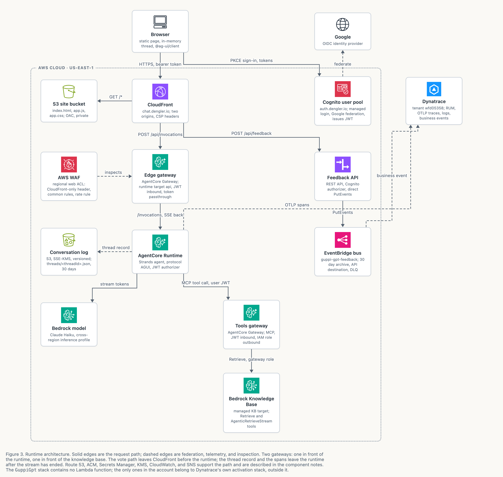
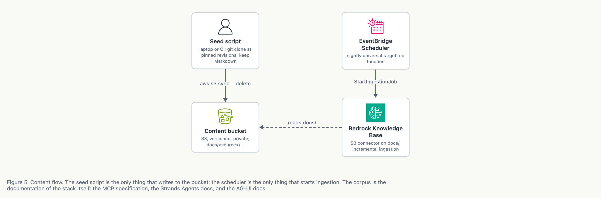

*GuppiGPT · architecture · September 2026*

# GuppiGPT architecture

> Markdown copy of [`guppigpt-architecture.html`](guppigpt-architecture.html), made on 6 October 2026 for reading on GitHub. The HTML file is the original. The diagrams are the PNG renders beside it.

One page, stateless, plain text chat behind Google sign-in. Everything runs in `us-east-1`; there is no Lambda function in the request path or the content sync path.

*Figure 3. Runtime architecture. Solid edges are the request path; dashed edges are federation, telemetry, and inspection. Two gateways: one in front of the runtime, one in front of the knowledge base. The vote path leaves CloudFront before the runtime; the thread record and the spans leave the runtime after the stream has ended. Route 53, ACM, Secrets Manager, KMS, CloudWatch, and SNS support the path and are described in the component notes. The `GuppiGpt` stack contains no Lambda function; the only ones in the account belong to Dynatrace's own activation stack, outside it.*

*Figure 5. Content flow. The seed script is the only thing that writes to the bucket; the scheduler is the only thing that starts ingestion. The corpus is the documentation of the stack itself: the MCP specification, the Strands Agents docs, and the AG-UI docs.*

- **Route 53**: `dengler.io` zone: chat and auth aliases, apex placeholder
- **ACM**: two certificates in `us-east-1`
- **Secrets Manager**: X-Origin-Verify value, dynamic reference
- **CloudWatch**: billing, WAF metric, and ingestion alarms
- **SNS**: one alarm topic, optional email

*Supporting services, outside the request path.*

Icons from the AWS Architecture Icons set (aws.amazon.com/architecture/icons), used under the AWS trademark guidelines for architecture diagrams.
