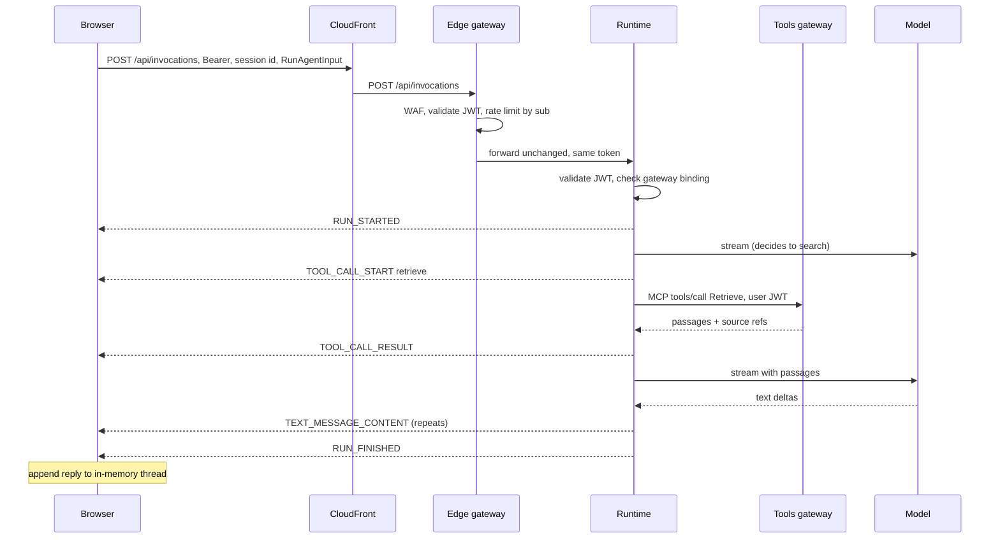

*Design · GuppiGPT · September 2026*

# GuppiGPT single page chat

> Markdown copy of [`guppigpt-design.html`](guppigpt-design.html), made on 6 October 2026 for reading on GitHub. The HTML file is the original. The diagrams are the PNG renders beside it and Mermaid; the page mockups are reduced to their text.

A one page, stateless, plain text conversational interface behind Google sign-in, served from CloudFront, streamed through AgentCore Gateway from a Strands agent on AgentCore Runtime that reads a Bedrock Knowledge Base through a second AgentCore Gateway.

> **Status.** Everything in this document is deployed in `us-east-1` and was last reconciled against the account on 7 September 2026, except the items listed in section 16. The implementation lives in the `guppi-gpt` repository. There is no Lambda function in the request path or in the content sync path, and none in the `GuppiGpt` stack at all; the only ones in the account belong to Dynatrace's activation stack (section 12). The alternatives that were considered and set aside on the way to this design are in the companion decision log; this document describes only the design as it stands.

## <a id="problem"></a>1. The problem

A person opens `chat.dengler.io`, signs in with Google, sees a greeting and a text box, types a question, and watches the answer appear word by word. When the question touches material in the knowledge base, the agent looks it up first and a short status line says so. They ask a follow-up and the answer accounts for what was said before. They close the tab and the thread leaves the page. The next visit opens on a blank page, already signed in.

Four things outlive the tab. The sign-in session persists: the refresh token sits in IndexedDB and rotates on every use, so a reload restores the session with a silent refresh instead of a redirect. Each conversation is written to a private S3 bucket and kept for 30 days, under a keyed hash of the account rather than the account itself, so a reply that came back wrong can be read back while it is being investigated. A vote on a reply is recorded as a business event on a path of its own. A Chats panel that keeps threads in the browser is built behind a feature flag and is off. The page reads none of this back: what it shows is what the current tab has produced.

That is the whole product. The claude.ai interface carries a great deal more: conversation history, projects, attachments, artifacts, model selection. GuppiGPT keeps the conversational core, adds one retrieval tool, and drops the rest. The value of the exercise is a system small enough to hold in one head that still exercises the managed agent stack end to end: identity, runtime, gateway, knowledge base, and observability.

The design has to answer five questions: what the page looks like and how it behaves, how a user is identified, how the browser talks to the agent, which AWS services sit between the browser and the model, and what protocol carries the stream.

## <a id="requirements"></a>2. Requirements

Requirements are written in EARS form[\[1\]](#r1) so that each one maps to a testable behavior.

### Identity

- When an unauthenticated user opens the page, the system shall show a sign-in screen with a single Google option and no other content.
- The system shall keep the refresh token in IndexedDB, restore the session on load with a silent refresh, rotate the refresh token on each use, and clear it on sign out; the access and id tokens shall stay in page memory.
- When a tab refreshes its access token, the system shall use the refresh token most recently stored by any tab of the same browser rather than the copy that tab holds in memory, since rotation invalidates the older copy.
- When the token expires during a page session, the system shall obtain a new one without showing the sign-in screen, provided the identity provider session is still valid.
- The system shall reject any agent request that does not carry a valid token issued for this application.

### Conversation

- When the user submits a non-empty message, the system shall append the message to the visible thread and start an agent run.
- While a run is in progress, the system shall render each text delta as it arrives, and shall disable the send control.
- When the user submits a message, the system shall include every prior message of the current page session in the run, so that replies carry context.
- While the `history` feature flag is off (the default), when the page is reloaded or closed the system shall discard the conversation, and no message shall be persisted in browser storage.
- While the `history` feature flag is on, the system shall keep threads in the browser's IndexedDB only, shall let the user open, delete, and clear them, shall clear them on sign out, and shall say so in the composer hint.
- When the user activates New chat, the system shall clear the thread and return to the empty state.

### Conversation logging

- When a run's stream ends, the agent shall write the thread's record, the messages as the page sent them plus the reply, the created and updated times, and one entry per run, to the conversation log bucket, keeping the previous version.
- The thread record shall identify the user by a keyed hash of the subject claim only, and shall carry neither the bearer token, nor the email address, nor the raw subject claim.
- If a thread record cannot be read or written, then the agent shall log the failure and shall leave the run's events and outcome unchanged.
- The system shall let the runtime read and write thread records by key, and shall let only the investigator role read them and the subject key.
- The system shall expire a thread record 30 days after its last write.
- While the `logging` feature flag is on, the page shall state in the composer hint and the empty state that conversations are logged for troubleshooting.

### Feedback

- While the `feedback` feature flag is on, when a reply has finished streaming, the system shall offer an up and a down vote beneath it.
- When the user chooses the vote already recorded, the system shall withdraw it, and the withdrawal shall be recorded in its own right.
- When a vote is cast or withdrawn, the system shall post it to the feedback API, which shall put one event on the feedback bus, which shall keep it for 30 days and forward it to Dynatrace as a business event.
- A vote shall carry the thread, run, trace, request, and message ids, and shall carry no message text.
- If the vote request fails, then the system shall leave the reply and the thread unchanged and shall not interrupt the conversation.

### Traceability

- When the user sends a message, the page shall mint a W3C `traceparent` for that run and shall send it with the request.
- The agent shall write one JSON record per run carrying the trace id, the runtime request id, the thread, run, and session ids, the token counts, the latencies, and the outcome, and no message text.
- The container shall emit spans for the run, the model call, and the retrieval under the trace id the page minted.
- The system shall stamp the run, trace, and request ids on the reply element, where support can read them without a network capture.

### Retrieval

- When a question can be answered from the knowledge base, the agent shall retrieve relevant passages through AgentCore Gateway before answering.
- While a retrieval is in progress, the system shall show a short status line in place of the reply.
- All model output shall stream to the page; no component in the path shall buffer a complete reply before forwarding it.

### Input

- The system shall accept plain text only. Attachments, images, and file drops shall be ignored.
- The system shall render replies as plain text with newlines preserved. No Markdown or HTML shall be interpreted.
- When the user presses Enter, the system shall send the message; when the user presses Shift+Enter, the system shall insert a newline.
- If a message exceeds 4,000 characters, then the system shall refuse to send it and shall show the limit inline.

### Failure

- If a run fails or the stream ends without a finished event, then the system shall show an inline error with a Retry control, and shall keep the user's message in the thread.
- If the stream stalls for more than 30 seconds without an event, then the client shall abort the run and treat it as a failure.

### Operations

- The system shall serve the page and the agent endpoint from one domain, with no cross-origin request from the browser.
- The system shall be deployable from one infrastructure definition with one command.
- The system shall read feature flag defaults from a file committed to the repository, and a flag flip shall need a page publish rather than a stack deploy.
- When a `ff` query parameter names flags, the page shall apply them to every tab of that browser until they are changed again.
- No observability shall sit behind a feature flag, except the RUM script, whose injection starts a vendor library rather than reading state the page already holds.
- When spend, a web ACL metric, the nightly ingestion, a gateway or runtime error rate, runtime p90 latency, or model throttling crosses its threshold, the system shall notify the alarm topic.

## <a id="page-design"></a>3. Page design

The page has three regions stacked vertically: a header bar, the message thread, and the composer. There is no sidebar, because there is nothing to put in one. The layout is a single centered column, 760px at most, so it reads the same on a laptop and a phone.

```text
GuppiGPT
You: What does our travel policy say about booking hotels outside the preferred list?
GuppiGPT Searched the knowledge base Hotels outside the preferred list can be booked when no preferred property is available within 10 miles of the work location, or when the preferred rate is more than 20% above the best available rate. The booking needs a note in the expense report and manager approval above $250 per night
Reply to GuppiGPT Enter to send, Shift+Enter for a new line. Conversations are logged for troubleshooting. ↑
Enter to send, Shift+Enter for a new line. Conversations are logged for troubleshooting.
```

*Figure 1. The page mid-reply after a knowledge base lookup. The status line records the tool call and the reply streams in as plain text.*

### Regions

**Header bar.** The product name on the left; New chat and the signed-in user's initials on the right. New chat resets in-memory state; it does not navigate. Clicking the initials shows the account email and a Sign out link. Sign out clears page state and redirects to the Cognito logout endpoint.

**Thread.** User messages sit on the right in a filled bubble. Agent replies sit on the left with no bubble, a small label, and plain text with newlines preserved. When the agent calls the retrieval tool, a muted status line ("Searching the knowledge base") appears above the reply and settles to past tense when the tool returns. The thread scrolls to the bottom on every new delta unless the user has scrolled up, in which case a small "Jump to latest" pill appears.

**Composer.** A textarea that grows to a maximum of eight lines, a send button, and a one-line hint. The hint states the keyboard behavior and then what becomes of the conversation, which is the only privacy notice the app needs and stays visible at all times. That second sentence follows two flags, and the wording for every combination lives in `web/src/copy.js`: with both off, "Nothing is saved."; with `logging` on, the deployed state, "Conversations are logged for troubleshooting."; with `history` on, "Chats are saved on this device."; with both on, one sentence carrying both clauses. The `history` flag also puts a Chats control in the header. The `feedback` flag, off by default, puts two muted thumbs under each finished reply to take an up or down vote.

### States

```text
GuppiGPT
GuppiGPT Sign in to start a conversation. Continue with Google

GuppiGPT
What can I help with? Ask anything. Conversations are logged for troubleshooting.
Ask GuppiGPT Enter to send, Shift+Enter for a new line. ↑
Enter to send, Shift+Enter for a new line.

GuppiGPT
You: Which regions is the knowledge base replicated to?
GuppiGPT Searching the knowledge base…
Reply to GuppiGPT Enter to send, Shift+Enter for a new line. ↑
Enter to send, Shift+Enter for a new line.

GuppiGPT
You: Summarize the Converse API in two sentences.
Reply to GuppiGPT Enter to send, Shift+Enter for a new line. ↑
Enter to send, Shift+Enter for a new line.
```

*Figure 2. Clockwise from top left: sign-in, empty thread after sign-in, a retrieval in progress, and a failed run with Retry.*

The client tracks two variables. `auth` is `anonymous` or `signed-in`. `status` is `idle-empty`, `idle`, `running`, or `error`; within `running`, a tool-call flag drives the status line. Retry re-sends the same message list that produced the failure. Send is enabled only in the two idle states with non-empty input.

### Visual treatment

Warm off-white background, a single accent color for the caret and send button, system font stack, no icons beyond the arrow, the Google mark, and the two thumbs on the feedback control (inline SVG, outlined until pressed). Dark mode follows `prefers-color-scheme` with the same accent values. The visual target is a page that looks finished with about 150 lines of CSS.

## <a id="architecture"></a>4. Architecture

The browser talks to two hosts under one domain: `chat.dengler.io`, the CloudFront distribution, for everything in the app, and `auth.dengler.io`, the Cognito managed login, for sign-in redirects. CloudFront serves the static page from S3 and forwards `POST /api/invocations` to the edge gateway, an AgentCore Gateway whose one target is the AgentCore Runtime[\[14\]](#r14). The edge gateway validates the user's JWT, applies WAF and per-user rate limits, and forwards the request and the SSE stream to the runtime unchanged. The runtime validates the JWT again and runs a Strands agent that streams AG-UI events back. When the agent needs the knowledge base it calls the tools gateway, a second AgentCore Gateway, over MCP; that gateway exposes the Bedrock Knowledge Base as MCP tools with no code in between[\[2\]](#r2).

The request path is therefore WAF, edge gateway, runtime, tools gateway, knowledge base. Section 4.2 explains why the last two hops are a choice rather than a requirement.

One path does not go through the runtime at all. A vote on a reply is a business event rather than a turn, so `POST /api/feedback` on the same domain reaches a small REST API that validates the body, checks the same Cognito token, and puts one event on an EventBridge bus with no compute in between; a rule forwards it to Dynatrace as a business event and an archive on the bus keeps every vote for 30 days.

Two more paths open when a run's stream has ended. The agent reads, merges, and writes the thread's record in the conversation log bucket from a background task, which is the only writer of that bucket and which the page never reads back. The container exports its spans over OTLP to Dynatrace, the three vended log groups are forwarded to the same tenant through Firehose, and the votes arrive there as business events, so the spans, the logs, and the votes for one turn are queried in one place. Section 12 describes the three signal paths, the RUM session that carries the page's flags, and the alarms that stay in CloudWatch.


*Figure 3. Runtime architecture. Solid edges are the request path; dashed edges are federation, telemetry, and inspection. Two gateways: one in front of the runtime, one in front of the knowledge base. The vote path leaves CloudFront before the runtime; the thread record and the spans leave the runtime after the stream has ended. Route 53, ACM, Secrets Manager, KMS, CloudWatch, and SNS support the path and are described in the component notes. The `GuppiGpt` stack contains no Lambda function; the only ones in the account belong to Dynatrace's own activation stack, outside it.*

### Component notes

| Component | Role | Configuration that matters |
| --- | --- | --- |
| Cognito user pool | Issues the JWT the rest of the system trusts | One app client, Authorization Code grant with PKCE, no client secret. Google configured as an OIDC identity provider; the managed login page shows only the Google button[\[3\]](#r3). Self-registration through Google is on and any Google account is admitted; there is no allow-list and no pre-sign-up trigger. Managed login is served at `auth.dengler.io`, a user pool custom domain backed by an ACM certificate in `us-east-1`[\[21\]](#r21); Cognito requires an A record on the parent `dengler.io` before it will issue the domain[\[21\]](#r21); the stack creates a placeholder record for that purpose (see the Route 53 row) and Cognito hands back a CloudFront alias target for the `auth` record. Callback and logout URLs are `https://chat.dengler.io/`. Access token lifetime 60 minutes, refresh token 30 days. The access token is the bearer everywhere, since the runtime and gateway authorizers match `allowedClients` against its `client_id` claim. |
| S3 bucket | Holds `index.html`, `app.js`, `app.css` | Block public access on; CloudFront reads through an origin access control[\[4\]](#r4). |
| CloudFront | TLS termination, caching for static files, one domain for page and API | Alias `chat.dengler.io` with an ACM certificate in `us-east-1`, validated by DNS. Default behavior to S3 with caching. A second behavior for `/api/*` whose origin is the edge gateway's hostname, caching disabled, compression disabled so the SSE bytes are not held back for gzip, the `AllViewerExceptHostHeader` origin request policy so `Authorization` and the session id reach the gateway while the `Host` header stays the gateway's own (forwarding the viewer's `Host` would make the gateway reject the request), a custom origin header `X-Origin-Verify` whose value the stack generates in Secrets Manager and references from both the origin and the WAF rule as a dynamic reference, and the origin response timeout set to 60 seconds (the default is 30; the AgentCore custom domain guide uses 120[\[5\]](#r5)). Section 13 explains what this timeout bounds. CloudFront's only jobs on this path are the shared domain and the same-origin request; WAF and rate limiting have moved to the gateway. |
| Route 53 and ACM | DNS and certificates for `dengler.io` | The `dengler.io` hosted zone is in Route 53 in the same account, so the CDK stack creates every record: the `chat` alias to the distribution, the `auth` alias to the Cognito target, the certificate validation records, and a placeholder A record at the apex. The apex has no A record today, and Cognito refuses to create the custom domain until one resolves[\[21\]](#r21). The placeholder points at `192.0.2.1`, an address in the TEST-NET-1 range reserved for documentation and never routed[\[28\]](#r28), with a record comment stating that it exists only to satisfy Cognito. The user pool domain resource depends on that record so CloudFormation orders them. A browser opening `dengler.io` gets no response, which is acceptable since nothing is published there. Both certificates must be in `us-east-1` because CloudFront terminates TLS for both hostnames. |
| Edge gateway | Policy enforcement point in front of the runtime | An AgentCore Gateway with one target of type AgentCore Runtime, named `api`, reached at `/api/invocations`, so the CloudFront `/api/*` behavior forwards the path unchanged[\[14\]](#r14). The gateway forwards the request body and the SSE response without protocol translation, so AG-UI passes through intact. Inbound auth is a JWT authorizer on the user pool. Outbound credential is token passthrough: the gateway validates the user's JWT and forwards it unchanged, so the runtime still sees the user. Identity-based rate limits keyed on `$.context.jwt.sub`[\[15\]](#r15) are an `EdgeGatewayPerUserRateLimit` resource in the stack, allowing 30 requests a minute and 2 concurrent connections per subject; they fail open, so the WAF rate rule stays the backstop. Request and response interceptors are not attached: they work only in buffered mode today, which would break streaming[\[14\]](#r14). |
| AWS WAF | Managed rules and per-address rate limit | A regional web ACL in the gateway's region, associated directly with the edge gateway[\[16\]](#r16). Three rules: a CloudFront-only rule that blocks any request missing a secret header the distribution adds on the way to the origin[\[18\]](#r18); the AWS managed common rule set; and one rate-based rule[\[9\]](#r9). Because every request arrives from a CloudFront edge address, the rate rule keys on the viewer address in `X-Forwarded-For`, which is safe only because the first rule guarantees CloudFront set it. The gateway's failure mode stays at the default, fail-closed. Rules ran in COUNT from 3 Sep 2026 and block since 4 Sep 2026, after a day of real prompts, code-heavy replies included, produced no counts on any rule; `WAF_BLOCK` in the stack returns them to counting. Metrics `WafBlocks`, `WafFailCloses`, and `WafFailOpens` in the `AWS/Bedrock-AgentCore` namespace get alarms. |
| AgentCore Runtime | Hosts the agent; the only compute in the system | Protocol `AGUI`[\[6\]](#r6), so the container speaks AG-UI over SSE on `/invocations`. The runtime target reference names HTTP, MCP, and A2A runtimes and does not mention `AGUI`[\[14\]](#r14), but the gateway accepts an AGUI runtime as a runtime target and forwards its SSE stream without inspecting it. Inbound auth is a JWT authorizer pointed at the user pool's OIDC discovery URL with the app client id in `allowedClients`, a request header allowlist naming `Authorization` and `traceparent` so the validated bearer and the trace the page started both reach the container (a header the allowlist omits is dropped silently), and no `allowedWorkloadConfiguration`: the binding to the edge gateway is off, for the reason given in section 11[\[7\]](#r7). Each browser page load generates one runtime session id, which gives each user their own isolated session for the life of the tab. The container starts under `opentelemetry-instrument` and receives the tools gateway URL, the model id, the retrieval tool name, the log level, the excluded URL pattern that keeps health checks out of the spans, and the three conversation log variables. |
| Strands agent | The agent loop: model, system prompt, one MCP tool | Python, `strands-agents` with the AG-UI adapter from the AG-UI project[\[8\]](#r8). Bedrock model provider with streaming on. One MCP client pointed at the tools gateway. No AgentCore Memory: the run input carries the full thread, and the agent holds nothing between runs. |
| Tools gateway | Exposes the knowledge base as MCP tools | A second AgentCore Gateway with an inbound JWT authorizer on the same user pool, so the user's token is accepted here as well. One target of type managed knowledge base, which provides `Retrieve` and `AgenticRetrieveStream`[\[2\]](#r2). Outbound credential is the gateway's IAM role with `bedrock:Retrieve` on the one knowledge base ARN. The agent calls `Retrieve` only, so MCP response streaming on this gateway stays off[\[17\]](#r17). |
| Feedback API | Takes a vote on a reply, off the chat path | A regional API Gateway REST API named `guppi-gpt-feedback`, one stage `prod`, one `POST /api/feedback` method behind a Cognito user pool authorizer on the same pool. The method sits at `/api/feedback` rather than `/feedback` because CloudFront forwards the viewer path unchanged under the origin path `/prod`: a resource at `/feedback` answered the doubled path `/prod/api/feedback` with "Missing Authentication Token". The method names the `openid` scope, because a user pool authorizer with no scope reads the bearer as an identity token and refuses the access token the page holds. A request validator checks the body against a model (vote, run id, thread id required; trace, request, and message ids optional; nothing else allowed), and the integration is a direct AWS service call to `events:PutEvents` with a mapping template that adds the verified `sub` claim and the arrival time, so no compute sits in the path. CloudFront reaches it through an `/api/feedback` behavior listed before `/api/*`, since behaviors are matched in the order they appear. An EventBridge rule sends each vote to an API destination on Dynatrace's business events endpoint, with two retries and a dead letter queue; a 30 day archive on the bus keeps every vote whether or not Dynatrace is configured. The control on the page stays behind the `feedback` flag, on from 5 Sep 2026 and off again since 8 Sep 2026 at Sam's request; a tab shows the thumbs with `?ff=feedback`. |
| Bedrock Knowledge Base | Document store and retrieval | A managed knowledge base with one S3 connector over the content bucket, managed embedding, default chunking[\[22\]](#r22). What it holds and how it syncs is section 10. |
| Bedrock model | Inference | A Claude Haiku cross-region inference profile, chosen for latency to first token and per-turn cost. The runtime execution role is granted `bedrock:InvokeModelWithResponseStream` on that one profile. |
| Conversation log | Keeps each thread for 30 days so a reply can be read back | A versioned S3 bucket encrypted with a stack-created KMS key (bucket keys on, TLS enforced, all public access blocked), holding one object per thread at `threads/<threadId>.json`, with a lifecycle rule expiring current versions 30 days after the write and noncurrent versions 30 days after they became noncurrent. The runtime role holds `GetObject` and `PutObject` under `threads/` and `ListBucket` scoped to that prefix, and no delete; the bucket policy denies reads to every principal other than the runtime role and `ConversationInvestigatorRole`, whose trust is the account root unless the `InvestigatorPrincipalArn` parameter narrows it. The subject key is a 32 character secret the stack generates in Secrets Manager, read once per container, and used for the HMAC-SHA256 pseudonym on both the thread record and the run log line; re-identification is the investigator reading that key and enumerating the user pool. `CONVERSATION_LOG_ENABLED` in the stack decides whether the agent writes, and has been on since 5 Sep 2026; the bucket, the key, the secret, and the role exist either way. |
| EventBridge | Carries a vote to Dynatrace and keeps a copy | A bus named `guppi-gpt-feedback`; an archive on it with 30 day retention matching `source: guppigpt.feedback`, created whether or not the Dynatrace parameters are set, so no vote is lost and a replay refills the tenant; and one rule whose target is an API destination on the tenant's business events endpoint, with a connection that sends the API token as `Authorization: Api-Token`, two retries, and an SQS dead letter queue holding 14 days. The rule's input transformer flattens the vote into `event.type` `guppigpt.reply-feedback`, `event.provider` `guppigpt`, and one field per identifier, since Grail keeps a top-level attribute as a field and turns a nested object into a string. |
| Vended log groups | What the two gateways and the runtime write | Three CloudWatch Logs groups under `/aws/vendedlogs/bedrock-agentcore/` (`guppi-gpt-edge`, `guppi-gpt-tools`, `guppi_gpt`), 30 day retention, each wired as a delivery source, a delivery destination of type `CWL`, and a delivery joining the two, with one CloudWatch Logs resource policy for `delivery.logs.amazonaws.com` over the whole prefix. `APPLICATION_LOGS` only: the service refuses a `TRACES` delivery to a CloudWatch Logs destination (section 15). A subscription filter on each group sends its records to a Firehose stream whose HTTP destination is Dynatrace's log ingest path, GZIP encoded, buffered at 1 MiB or 60 seconds, with undeliverable batches parked for seven days in a small bucket of their own. The agent's own per-run record lands in the runtime's service-created log group, which the stack does not own and therefore cannot subscribe. |
| CloudWatch Transaction Search | The account's span destination | A transaction search configuration with 1 percent indexing, plus the log resource policy that lets X-Ray write spans as structured logs. The stack owns both since 3 Sep 2026, because the instrumented container's spans were refused with 400 for as long as the destination was X-Ray. It is an account-wide setting that other workloads in the account inherit. Since the runtime gained the Dynatrace OTLP endpoint it receives no spans from this container; section 12 explains why, and what dual export would take. |
| CloudWatch alarms | What notifies the alarm topic | Estimated monthly charges at twice the expected figure; the edge gateway's three WAF metrics; the nightly ingestion schedule's failed invocations; `SystemErrors` on the edge gateway, the tools gateway, and the runtime; the edge gateway's `UserErrors` as a percentage of `Invocations`, at 10 percent; runtime `Latency` at p90 against 30,000 ms, half the CloudFront origin timeout, so a slow run is flagged before the origin cuts it; and `InvocationThrottles` on the one inference profile. Every alarm uses a five minute period, one evaluation period, and missing data treated as not breaching, and notifies one SNS topic. The thresholds are starting points chosen before real traffic. The gateway metrics carry a documented `Resource` dimension; the runtime alarms assume the same one and the WAF alarms assume `GatewayId`, both to be checked against real metric data. The topic's email subscription is still unconfirmed (section 16). |
| Dynatrace | Where traces, logs, business events, and RUM sessions are read | Tenant `wfd05358`. A RUM application whose script is self-hosted from the site bucket at `/dt/ruxitagentjs.js` and injected by the page, with its beacon origin admitted by `connect-src` when the `DynatraceBeaconOrigin` parameter is set. An OTLP endpoint and an API token, both read from 1Password at deploy time, which become the runtime's trace export settings and the credential for the Firehose log destination and the business events destination. The AWS connection is push-based: Dynatrace's wizard mints two platform tokens and hands over its own activation template, deployed once by hand as the stack `GuppiGPT-Dynatrace` in `us-east-1`, which creates a metric stream, Firehose deliveries, and the Lambda functions that ship inventory and logs. `AWS/Bedrock-AgentCore` and `AWS/Bedrock` are custom namespaces on that connection's monitoring configuration. Section 12 covers the signal paths and the dashboard. |

### <a id="kb-path"></a>4.2 Runtime to knowledge base: direct or through a gateway

The agent can call the knowledge base directly. `bedrock:Retrieve` on the runtime's execution role and the `retrieve` tool from the Strands tools package are all it takes, and nothing in the platform requires a gateway between an agent and a knowledge base. The question is what the gateway hop adds, and whether that is worth a second managed resource.

| Property | Runtime calls the knowledge base directly | Runtime calls it through the tools gateway |
| --- | --- | --- |
| Code | One tool from the Strands tools package, no MCP client | One MCP client with the user's token; the tool schema comes from the gateway |
| Credential | The runtime execution role; retrieval is attributable to the service, not the user | The user's JWT at the gateway, the gateway's role at the knowledge base; retrieval is attributable to the user |
| Policy point | IAM only | Gateway authorizer claim checks, per-user rate limits on tool calls, tool-level allow-lists, interceptors (buffered mode) |
| Blast radius of a compromised agent | Can read the whole knowledge base at will | Can read only what a valid user token can read, at that user's rate |
| Reuse | Each agent wires its own tool | Any MCP client with a token gets the same tools; the knowledge base becomes an MCP server |
| Latency | One AWS API call | One extra hop, tens of milliseconds |
| Resources | None beyond the knowledge base | A gateway, a target, a role |

The decision is to keep the gateway hop. The extra hop costs little, and it is the only place in the system where a retrieval carries the user's identity. That property is the one that would be missed later: without it, adding a second audience to the knowledge base means rewriting the agent instead of adding a claim check to a gateway. Direct retrieval remains the right choice for a throwaway agent or a single-tenant prototype, and the swap is a one-line change in the agent.

The edge gateway and the tools gateway are two resources because the platform requires it: a runtime target can only be added to a gateway with no protocol type, and the knowledge base target lives on an MCP gateway[\[14\]](#r14). The split also suits the design, since the two have different audiences (the browser and the agent), different rate-limit shapes, and only the edge carries a WAF policy.

### Where a Lambda proxy would be needed

There is no Lambda function in the request path or the content sync path, because every job one would do has a managed home: the edge gateway validates the JWT, hosts the WAF policy, and rate limits per user; the runtime streams and isolates sessions; CloudFront supplies the domain; and the tools gateway adapts the knowledge base to MCP. A Lambda would come back only for one of these reasons: reshaping the AG-UI stream into a different wire format for a client that cannot be changed (and even then, a gateway interceptor cannot do it in streaming mode, so it would be a proxy in the path); an authentication scheme the JWT authorizers cannot express; or a knowledge base type the managed target does not support, since that target covers managed knowledge bases only[\[2\]](#r2). None applies here. Lambda is a preference rather than a ban, and one case has been approved: the functions inside Dynatrace's own activation stack, which sits outside `GuppiGpt` and off both paths (section 12).

## <a id="request-flow"></a>5. Request flow



*Figure 4. One turn with a retrieval, after sign-in. Events from the runtime pass through the edge gateway and CloudFront untouched. The tools gateway to knowledge base hop is inside its lifeline. Nothing waits for a complete reply.*

The browser owns the conversation. Every run sends the full message list, so the agent holds nothing between runs. A reload clears the thread from the page, and the messages reach browser storage only while the `history` flag is on; the page never asks the server for a thread it has dropped. The server keeps its own copy for troubleshooting: once the stream has ended, a background task in the agent reads `threads/<threadId>.json`, merges this run into it, and writes it back under a conditional put, with a ten second timeout and a warning as its only failure mode. That copy names the user by a keyed hash and is readable only by the investigator role. The runtime session id ties the tab to one warm session so consecutive turns do not pay a cold start; it does not carry conversation state.

The user's JWT travels the whole path. CloudFront forwards it, the edge gateway validates it and passes it through, the runtime validates it and hands it to the agent, and the agent presents the same token to the tools gateway, which validates it again. That gateway then calls the knowledge base with its own IAM role. Identity is a user at every hop up to the last, and a service role only for the final AWS API call.

The trace id travels the same path. The page mints a `traceparent` for every send and every Retry, CloudFront forwards it, and both allowlists name it: the edge gateway target's allowed request headers and the runtime's request header configuration, either of which would drop it silently. Inside the container the ADOT instrumentation opens the server span for `POST /invocations` on the trace id the header carries, and the Strands spans, the MCP call to the tools gateway, and the Bedrock call hang below it, so the tools gateway's own records carry the same id. The agent's per-run log record names it beside the runtime request id, and the page stamps it on the reply element as `data-trace-id`. The spans leave the container over OTLP to Dynatrace; section 12 follows each signal to where it is read.

## <a id="wire-format"></a>6. Wire format

The wire format is AG-UI, the Agent-User Interaction Protocol[\[10\]](#r10), chosen over a private framing for two reasons: AgentCore Runtime speaks it natively, and the AG-UI project maintains an adapter for Strands, so neither the server nor the client needs custom framing code. Section 7 compares it with the alternatives.

### Request

An AG-UI run input, posted as JSON. The message list is the thread as the page renders it.

```
POST /api/invocations
Authorization: Bearer <Cognito access token>
X-Amzn-Bedrock-AgentCore-Runtime-Session-Id: <uuid, one per page load>
Accept: text/event-stream
Content-Type: application/json

{
  "threadId": "<uuid, one per New chat>",
  "runId": "<uuid, one per send>",
  "messages": [
    {"id": "m1", "role": "user", "content": "What does our travel policy say about ..."},
    {"id": "m2", "role": "assistant", "content": "Hotels outside the preferred list ..."},
    {"id": "m3", "role": "user", "content": "And for international trips?"}
  ],
  "state": {}, "tools": [], "context": [], "forwardedProps": {}
}
```

### Response

Server-sent events, one AG-UI event per `data:` line. The subset this app consumes:

```
data: {"type":"RUN_STARTED","threadId":"...","runId":"..."}
data: {"type":"TOOL_CALL_START","toolCallId":"t1","toolCallName":"docs___Retrieve"}
data: {"type":"TOOL_CALL_ARGS","toolCallId":"t1","delta":"{\"query\":\"hotel booking outside preferred list\"}"}
data: {"type":"TOOL_CALL_END","toolCallId":"t1"}
data: {"type":"TOOL_CALL_RESULT","toolCallId":"t1","content":"..."}
data: {"type":"TEXT_MESSAGE_START","messageId":"m4","role":"assistant"}
data: {"type":"TEXT_MESSAGE_CONTENT","messageId":"m4","delta":"Hotels outside"}
data: {"type":"TEXT_MESSAGE_CONTENT","messageId":"m4","delta":" the preferred list"}
data: {"type":"TEXT_MESSAGE_END","messageId":"m4"}
data: {"type":"RUN_FINISHED","threadId":"...","runId":"..."}
```

Every event is emitted by the Strands adapter without app code. The page reads the text and tool-call lifecycle events and ignores `TOOL_CALL_ARGS` and `TOOL_CALL_RESULT`, which stay on the stream for debugging. `RUN_ERROR` replaces `RUN_FINISHED` on failure. During a silent stretch (a tool call in flight, a slow first token) the agent emits an AG-UI `CUSTOM` event named `ping` every 15 seconds as a keepalive. It is a data line, so every hop forwards it, and the page's subscriber sees it and resets its stall timer. An SSE comment line would also keep CloudFront alive, but the client drops comments before the subscriber runs, so the stall timer would fire on a long tool call regardless.

## <a id="protocols"></a>7. Client-to-agent protocols and libraries

The question raised in review was whether an open standard or library already covers the browser-to-agent stream, in the way the OpenAI Chat Completions format covers the client-to-model call. Four candidates were examined.

| Option | What it is | Transport and shape | Fit for GuppiGPT |
| --- | --- | --- | --- |
| AG-UI[\[10\]](#r10) | Open event protocol for agent-to-user interaction, started by CopilotKit, with integrations for Strands, LangGraph, Pydantic AI, Microsoft Agent Framework, Google ADK, and others | SSE or WebSocket; typed events for run lifecycle, text messages, tool calls, state deltas, and custom events; TypeScript client `@ag-ui/client` | Strong. AgentCore Runtime has a native `AGUI` protocol mode[\[6\]](#r6) and the Strands adapter emits the events. Tool-call events map directly onto the retrieval status line. |
| Vercel AI SDK UI message stream[\[11\]](#r11) | The protocol behind the AI SDK's `useChat` hook; documented for use from any backend, with Python implementations from Pydantic AI and others | SSE with typed parts (text, reasoning, tool input and output, data, error), a `[DONE]` terminator, and a required `x-vercel-ai-ui-message-stream: v1` header | Good for a React front end that wants `useChat`. No AgentCore protocol mode, so the agent container would carry the encoder and the vanilla page would carry a parser anyway. |
| OpenAI Chat Completions and Responses streaming | The de facto client-to-model format; LiteLLM[\[12\]](#r12) proxies it to Bedrock and many other providers, and Bedrock offers an OpenAI-compatible endpoint of its own | SSE of `chat.completion.chunk` objects (Completions) or typed events (Responses) | Right layer for a model proxy, wrong layer for an agent. It has no event for a tool call the server executed or for a retrieval result, so the retrieval status line would need a side channel. Worth keeping in mind if GuppiGPT later exposes the model rather than the agent. |
| assistant-ui, CopilotKit | React component libraries with adapters for the protocols above | Consume AG-UI or the AI SDK stream | More UI than this page needs. CopilotKit is the reference AG-UI client and would be the choice if the page grew a React layer. |

Two other standards were set aside as out of scope: MCP, which is the tool-side protocol Gateway already speaks and carries no user-facing stream, and A2A, which is agent-to-agent. AG-UI's own positioning is that the three protocols are complementary, with AG-UI on the user-facing edge.

The choice is AG-UI, consumed in the browser by `@ag-ui/client`'s `HttpAgent`, which handles SSE parsing, event typing and ordering checks, and abort. A hand-written SSE reader of about 40 lines was used while the page had no bundling step and remains the fallback if the dependency ever becomes a problem.

## <a id="frontend"></a>8. Frontend design

Static files in `web/src/`, no framework, and one bundling step: esbuild bundles `@ag-ui/client`, the OpenFeature web SDK, and `idb` into one `app.js`, beside `index.html` and `app.css`. The PKCE flow is about forty lines and stays hand-written; `oidc-client-ts` would cost more wiring than it saves. No inline script or style, because the Content Security Policy is `default-src 'self'`.

**Sign-in.** On load, the page checks the URL for an OAuth code. If present, it finishes the Authorization Code with PKCE flow described below and saves the resulting session. Otherwise it looks for a session record in IndexedDB. When one is stored, the page calls the token endpoint with `grant_type=refresh_token`: on success it applies the new tokens, saves the rotated refresh token, and shows the chat screen with no redirect; on an OAuth error such as `invalid_grant`, meaning the refresh token has expired, been rotated out, or been revoked, it clears the stored session and falls back to the sign-in screen; on a network failure it leaves the stored session in place and falls back to the sign-in screen as well, so a later reload can try again. When no session is stored, the page shows the sign-in screen; the button starts an Authorization Code with PKCE flow against the Cognito managed login domain with `identity_provider=Google`, so the Cognito page is skipped and the user lands on Google directly. The callback route exchanges the code for tokens, applies them, and saves the session. The refresh token lives in IndexedDB and is rotated on every use, since the user pool client has refresh token rotation on, so a stolen token is good for one refresh. The access and id tokens stay in page memory only and never reach `localStorage`, `sessionStorage`, or IndexedDB; the one exception to no persistence is the PKCE code verifier, which sits in `sessionStorage` for the duration of the redirect and is removed on return. The refresh token also renews the access token in the background before each send if fewer than five minutes remain, saving the newly rotated token the same way. Sign out clears the stored session before redirecting to the Cognito logout endpoint.

**State.** One array, `messages`, holding `{id, role, content}` objects, plus `auth`, `status`, a `sessionId` generated once per page load, and a `threadId` regenerated on New chat.

**Send.** Push the user message, set status to running, construct an `HttpAgent` pointed at `/api/invocations` with the bearer and session headers and the thread as its initial messages, and call `runAgent` with a subscriber. `onTextMessageContentEvent` appends to the draft reply; `onToolCallStartEvent` and `onToolCallEndEvent` drive the status line; `onRunFinishedEvent` commits the reply to `messages`; `onRunErrorEvent`, a rejected `runAgent`, or a non-2xx response (turned into a failure by a custom `fetch`) moves to the error state. `onEvent` resets the stall timer for every event, the ping included. A stall timer aborts the run after 30 seconds without an event; the `ping` custom event counts, so a long tool call does not trip it. Retry after a `RUN_ERROR` or a transport error generates a fresh `sessionId`, which also covers a tab left open past the runtime's 8 hour session limit.

**Render.** Reply text goes into a `div` through `textContent` with `white-space: pre-wrap`, so newlines survive and nothing is interpreted as markup. There is no Markdown parser and no sanitizer, which removes the one script injection surface the page had. Rendering is scheduled with `requestAnimationFrame` and coalesced, so a burst of deltas produces one paint.

**Accessibility.** The thread is an `aria-live="polite"` region. The send button has a label. Focus returns to the textarea after each turn. Color contrast meets AA in both themes.

**Feature flags.** Product features ship dark behind flags whose defaults live in `web/features.json`; the deploy script copies them into `config.json`, so flipping one is an edit and a page-only deploy. The page reads them through the OpenFeature web SDK with a static provider, and a `?ff=history,feedback` query parameter (a leading dash turns one off) overrides them for every tab of the browser through `localStorage`, surviving the sign-in redirect the same way the earlier per-tab `sessionStorage` did. The provider stays static within a page load, so a change written by another tab reaches an already-open tab on its next reload, not live. A settings page at `/flags.html`, reachable only by URL and linked from nowhere, lists every flag's committed default, this browser's override, and the effective value, with a three-way control per flag and a reset-all control, writing the same `localStorage` key. Observability is never behind a flag, with one exception: `rum`, because injecting the script starts a vendor library rather than reading state the page already holds. A Dynatrace hook on the same client reports each evaluation as a session property, and the flags that resolved true are also on `<body>` as `data-features` for a support session working from the browser inspector. Details: `docs/proposals/feature-flags.md`.

**Chats (flag `history`, off).** Threads are stored in IndexedDB through the `idb` wrapper as id, title, timestamps, and messages; never tokens or account claims. A Chats control lists them newest first with delete and clear all, the newest reopens on load, and sign out clears the store. AG-UI has no persistence of its own; the thread id is the stored id. Details: `docs/proposals/local-history.md`.

**Feedback (flag `feedback`, off).** Two thumbs under a finished reply record an up or down vote, or withdraw it on a second click; a streaming reply and an interrupted one never carry the control. The vote is stamped on the reply element, saved on the stored message when Chats is on, and dispatched as a `guppi:feedback` DOM event carrying the thread, run, trace, request, and message ids. A subscriber posts those same fields to `POST /api/feedback` with the access token, fire and forget: no retry, no reading of the response, `keepalive` so a vote survives a closing page, and an abort after three seconds. A withdrawal is sent as `"none"` rather than an absent field, so it is a record of its own. The first sink was a Dynatrace RUM custom action; the tenant stores nothing from the classic JavaScript API, so a vote is a business event on its own path instead (sections 4 and 12). Details: `docs/proposals/feedback.md`.

**Conversation logging (runtime switch `CONVERSATION_LOG_ENABLED` and page flag `logging`, both on since 5 Sep 2026).** With the runtime switch on, the agent writes each thread after every run to `threads/<threadId>.json` in a versioned SSE-KMS bucket from a background task with a ten second timeout: the messages as sent, the reply, an HMAC-SHA256 pseudonym of the subject keyed by a stack-generated secret, timestamps, and a list of the runs. Only the runtime role can write and only a stack-defined investigator role can read; re-identification hashes the user pool's subjects with the key. The page flag is what makes the hint and the empty state say conversations are logged; the runtime switch is flipped first and turned off last, so the page never promises a record that does not exist. Details and the flip order: `docs/proposals/conversation-logging.md`.

**Traceability.** The page mints a W3C `traceparent` per run (the trace id opens with the epoch seconds so X-Ray accepts it) and sends it beside the bearer and the session id; the edge gateway target and the runtime allowlist pass it through. The container runs under `opentelemetry-instrument` with the AWS distro, so its spans, the MCP call to the tools gateway, and the agent's JSON log record all carry that trace id, and the log record also carries the runtime request id. The reply element holds the run, trace, and request ids as data attributes for support to read from the browser inspector; nothing is rendered. The spans leave the container over OTLP, which since the Dynatrace endpoint was set means Dynatrace rather than CloudWatch Transaction Search (section 12). Details: `docs/proposals/traceability.md`.

**Dynatrace RUM (flag `rum`, on).** The page inserts a script element pointing at the self-hosted RUM script in the site bucket, a same-origin path, so `script-src 'self'` is unchanged; the beacon origin is what the Content Security Policy has to admit, and it comes from a stack parameter. Once `window.dtrum` exists, an OpenFeature hook reports each flag evaluation as a session property, so a session shows which flags it saw. `dtrum.identifyUser` is available behind `config.rum.identifyUser` and is off. Details, including what has to exist in the tenant first: `docs/proposals/dynatrace.md`.

**Privacy and terms.** `privacy.html` and `terms.html` sit beside `index.html`, copied into the bundle the same way, so Google's OAuth consent screen has public URLs to link to.

## <a id="agent"></a>9. Agent design

One Python package (`app.py`, `agent.py`, `validation.py`, `keepalive.py`, `conversation_log.py`) in an arm64 container that the CDK stack registers on AgentCore Runtime with protocol `AGUI`. The runtime fronts the container, so the package contains a FastAPI app with `/invocations` and `/ping`, the Strands agent, and the AG-UI adapter. In order, per run:

1. Read the bearer token from the request headers. The runtime has already validated it; the agent decodes the claims without verification to get the `sub` claim for logging and forwards the raw token to the gateway. A Cognito access token carries `sub`, `username`, `client_id`, and scopes; the email lives only in the ID token, which the page holds for the account menu and never sends.
2. Validate the run input: 1 to 40 messages, alternating roles, ending in a user turn, each under 4,000 characters. On failure emit `RUN_ERROR` and return.
3. Trim from the front until the estimated input tokens fit a budget (16,000 to start).
4. Build the Strands agent with the Bedrock model provider (streaming on, `max_tokens` 1,024, temperature 0.7), the system prompt, and one MCP client whose transport is streamable HTTP to the gateway URL with the user's token as the bearer. The client is built per run, because the token can change between runs after a refresh, and lists tools once per run; the knowledge base target contributes `Retrieve` and `AgenticRetrieveStream`, and the agent is given `Retrieve` only.
5. Run the agent through the AG-UI adapter and yield its events into the SSE response, emitting a `CUSTOM` event named `ping` whenever 15 seconds pass without an event.
6. Log one JSON record per run: the pseudonymous subject, the thread, run, and session ids, the trace id and the runtime request id, the start time, the model id, the message count, whether retrieval ran, input and output tokens, latency to first delta, total latency, and outcome. The record the agent assembles holds the reply under a key beginning with an underscore, and the function that renders the line drops every such key, so no message text reaches the log group.
7. When the stream has ended, write the thread record from a background task with a ten second timeout: a GET of `threads/<threadId>.json`, a merge of this run into what it holds, and a conditional PUT (`If-None-Match: *` on the first write, `If-Match` on the ETag afterwards, one retry when another writer won). The user is named by the first 32 hex characters of an HMAC-SHA256 of the subject claim, keyed by a Secrets Manager secret the container reads once and caches, so a log line and a thread record carry the same pseudonym. A run whose outcome is `client_disconnected` is logged and not merged, since its messages arrive again with the next run. A failure is a warning: nothing about it reaches the stream, and the next run's write restores the text, because the page resends the whole thread.

The container starts under `opentelemetry-instrument` with the AWS distro, which is the whole of the instrumentation: the runtime supplies the exporter settings, the stack adds only the excluded URL pattern that keeps the health check out of the spans. The FastAPI instrumentation opens the server span on the trace id the `traceparent` header carries, Strands creates the agent, model, and tool spans under it through the same tracer provider, the MCP instrumentation injects the context into the calls to the tools gateway, and the botocore instrumentation records the Bedrock request id. The agent reads the same trace id out of the header for its log record, falling back to the active span and then to `-`, and adds the runtime's `x-amzn-requestid` when the runtime forwards one.

The system prompt names the assistant and states what it can recall: nothing between page loads, and, while the logging switch is on, that conversations are logged for troubleshooting. It says to search first and answer once when a question concerns the Model Context Protocol, Strands Agents, or AG-UI, without narrating the search or revising an earlier draft, and to answer from general knowledge otherwise. It asks for concise plain text with no headings, bullet markers, bold, links, or code fences, since the page renders none, with code indented by four spaces instead. It asks for server addresses written as `<server-url>` rather than localhost or a loopback address, because the gateway's front door rejects any message containing one and the page resends the whole thread (section 15). It stays under 300 tokens.

The agent uses `Retrieve`. It is one hybrid search that returns passages in about a second, which keeps the silent gap on the stream short, and the agent's own model then streams the answer. `AgenticRetrieveStream` plans, runs several retrievals, and streams trace events and a synthesized answer[\[19\]](#r19); its streaming reaches the agent over MCP, not the page, and forwarding its progress as AG-UI step events would be app code for a second model writing prose. It stays available on the gateway for a later multi-step question mode.

## <a id="content"></a>10. Knowledge base content and sync

The knowledge base holds the documentation of GuppiGPT's own stack: the Model Context Protocol specification[\[23\]](#r23), the Strands Agents documentation[\[24\]](#r24), and the AG-UI documentation[\[25\]](#r25). All three are Markdown in public GitHub repositories under MIT or Apache 2.0 licenses, together a few megabytes and a few hundred files. The choice was made on three grounds: the set is small enough that a full ingestion finishes in minutes and costs cents; it is plain Markdown, which the S3 connector indexes without parsing settings; and the questions a person will ask while testing this app ("what is an AG-UI run", "how does Strands register an MCP tool") are questions the corpus answers, so the retrieval tool gets exercised on every demo.

Alternatives considered were a set of Project Gutenberg books (public domain, larger, and a prose corpus that invites long summaries rather than lookups) and a Wikipedia subset (too large to keep small without a curation step of its own).


*Figure 5. Content flow. The seed script is the only thing that writes to the bucket; the scheduler is the only thing that starts ingestion. Neither is a Lambda.*

### Seed script

One shell script in the repository, run from a laptop or a CI job when the corpus should be refreshed. It clones the three repositories at a pinned tag, copies each one's `docs` tree and `LICENSE` file into a staging folder under `docs/<repo>/`, renames `.mdx` to `.md` (the connector indexes Markdown; MDX is Markdown with imports that the parser ignores), drops images and other binaries, and runs `aws s3 sync --delete --size-only` to the content bucket. The size comparison matters because every clone is fresh: comparing modification times would re-upload the whole corpus and re-ingest it on every run, while an edit that keeps a file's exact byte length is rare enough to accept. The `--delete` flag matters: the knowledge base removes documents that disappear from the bucket on the next ingestion, so a renamed file in an upstream repository does not leave a stale copy behind. A `docs/<repo>/.metadata.json` sidecar is not needed for retrieval and is left out.

### Ingestion

The managed knowledge base has one data source, an S3 connector pointed at the `docs/` prefix of the bucket, with managed embedding and default chunking[\[22\]](#r22). Ingestion is started by `StartIngestionJob` and is incremental: unchanged objects are skipped, changed ones are re-chunked and re-embedded, and deleted ones are removed[\[26\]](#r26). An EventBridge Scheduler schedule calls that API once a night as a universal target, which is the AWS SDK call expressed as scheduler configuration with no function in between[\[27\]](#r27). The schedule's role is allowed `bedrock:StartIngestionJob` on the one knowledge base; the knowledge base role is allowed `s3:ListBucket` and `s3:GetObject` on the one bucket. On a night when nothing changed the job finishes in seconds and indexes nothing. The connector's deletion safeguard, which skips the delete phase when a sync would remove more than a set share of documents, is disabled so that an upstream reorganisation is mirrored rather than left half applied; the corpus is public documentation that the seed script can restore.

Nightly is a floor, not a design constraint. After running the seed script, an ingestion can be started by hand with one CLI call, and the scheduler can be pointed at any rate. An S3 event that triggers ingestion on every upload was considered and set aside: it needs a Lambda or a Step Functions state machine between the event and the API, and it starts one job per object when the seed script writes hundreds of them.

Ingestion status is visible through `ListIngestionJobs` and in the knowledge base console. One CloudWatch alarm on the scheduler's failed invocation count covers the case where the nightly call itself fails.

## <a id="security"></a>11. Security and cost limits

Identity is present at every hop, so the exposure is narrow: an attacker needs a Google account that the user pool admits, and every run is attributable. The controls:

| Control | What it bounds | Where |
| --- | --- | --- |
| Cognito admission | Who can obtain a token at all | Any Google account, for now. The per-user rate limits below are what will bound spend under that policy; an allow-list can be added later as a pre-sign-up trigger without touching the app. |
| JWT validation at the edge gateway | Only tokens from this pool and app client reach the runtime | Edge gateway JWT authorizer: discovery URL and `allowedClients` |
| Per-user rate limits | Requests per minute and concurrent connections per signed-in user, and therefore per-user spend | Edge gateway rate limits keyed on the JWT `sub` claim[\[15\]](#r15): a `GatewayRateLimit` resource in the stack allowing 30 requests a minute and 2 concurrent connections per subject. Rate limits fail open by design, so the WAF rate rule remains the backstop |
| JWT validation at the runtime | Only tokens from this pool and app client are accepted, including at the runtime endpoint itself | Runtime JWT authorizer: discovery URL and `allowedClients`. Binding the runtime to the edge gateway with `allowedWorkloadConfiguration` is off. With it on, the runtime demands a transaction token, and the gateway supplies one only when it signs the request as its own role, which a JWT runtime then rejects as an authorization method mismatch. The stack keeps the binding behind the `bind_runtime_to_gateway` context flag for the day token passthrough carries the gateway identity. |
| JWT validation at the tools gateway | Only the same users can search the knowledge base, even from a compromised agent | Tools gateway JWT authorizer on the same pool |
| Least-privilege roles | What each service can reach | Runtime role: invoke one inference profile. Tools gateway role: `bedrock:GetKnowledgeBase` and `bedrock:Retrieve` on the one knowledge base, plus `bedrock:AgenticRetrieveStream`, which the service does not scope to a resource. Edge gateway role: `InvokeAgentRuntime` on the one runtime, unused while the target passes the token through. |
| WAF | Requests that did not come through CloudFront, known exploit patterns, and requests per 5 minutes from one viewer address, all before any token is checked | Regional web ACL on the edge gateway[\[16\]](#r16); rate rule keyed on `X-Forwarded-For` |
| Feedback API authorization | Who can put a vote on the feedback bus, and how fast | The same Cognito user pool, through an API Gateway authorizer on the one `POST /api/feedback` method, plus a request validator that refuses any body the model does not describe. Rate is API Gateway's account-wide default throttle, 10,000 requests a second, which no page can approach; a usage plan is the follow-up if a real limit is ever wanted (`docs/proposals/feedback.md`). |
| Conversation log access | Who can read stored conversations | The bucket policy denies reads to every principal except the runtime role and the investigator role, the KMS key policy is the second gate, and the runtime holds no delete and no listing outside the `threads/` prefix. Re-identifying a record needs the subject key in Secrets Manager and read access to the user pool, which only the investigator role holds together; every assumption of it and every object it reads is in CloudTrail. Records expire 30 days after their last write. |
| Input caps and `max_tokens` | Cost of any single run | Agent validation |
| Runtime session limits | Concurrent sessions and their lifetime | Sessions idle out at 15 minutes and end at 8 hours; a service quota bounds concurrency |

A billing alarm at twice the expected monthly figure closes the loop. Content Security Policy is `default-src 'self'` plus `connect-src` for `auth.dengler.io`, with no inline script. The page sets no cookies of its own. The refresh token kept in IndexedDB is readable only by same-origin script, which the Content Security Policy restricts to the bundled app, and rotation limits a stolen token to one use. The conversation log bucket is now the most sensitive store in the system: it holds what people asked and what they were told, under a pseudonym, and the two roles named above are the whole of its read surface.

The CloudFront origin for the edge gateway carries no origin access control. A caller who discovers the gateway hostname is stopped by the WAF's CloudFront-only header rule, which has blocked since 4 Sep 2026[\[18\]](#r18); a direct call to the gateway hostname now answers 403 from the web ACL. The gateway's JWT authorizer and the per-user rate limits are the second layer behind it. What CloudFront adds on this path is the shared domain, which keeps the browser's request same-origin.

## <a id="observability"></a>12. Traces, logs, business events, and RUM

Four kinds of telemetry leave this system and three of them end in the same Dynatrace tenant, `wfd05358`. Spans leave the container over OTLP. Log records leave the vended log groups through Firehose. Votes leave the EventBridge bus as business events. RUM sessions come from the page itself. What stays in CloudWatch is the metrics, the alarms on them, and the account's transaction search configuration, which the container's spans no longer reach. Every path carries at least one of the identifiers section 5 follows, which is what makes one turn findable across all of them.

### Traces from the page to Dynatrace

The page mints a W3C `traceparent` for every send and every Retry, with a trace id that opens with the epoch seconds so it is also a well-formed X-Ray trace id. Two allowlists have to name the header, the edge gateway target's allowed request headers and the runtime's request header configuration, and a header either one omits is dropped in silence, which is how the `Authorization` header was lost on the first deploy.

The container holds no tracing code. It starts under `opentelemetry-instrument` with the AWS distro, the runtime supplies the exporter settings, and the stack adds only the excluded URL pattern that keeps the health check out of the spans. One turn produces about nineteen spans: the server span for `POST /invocations`, the Strands agent and model spans, the MCP session and tool call spans, the Secrets Manager and S3 calls of the thread record write, and the Bedrock call with its request id.

Setting the Dynatrace endpoint redirects that export rather than adding to it. Observed on 5 Sep 2026: with `OTEL_EXPORTER_OTLP_TRACES_ENDPOINT` and `_HEADERS` on the runtime, all nineteen spans of a turn appeared in Dynatrace and none reached CloudWatch Transaction Search. The OpenTelemetry environment scheme carries one endpoint and one header set per signal type, so the container's explicit values win over the ones the platform injects for X-Ray, and no environment variable names two OTLP destinations. Dual export needs a second span exporter and a second batch span processor registered in the agent's own code, which is a code change rather than a parameter, and it is deferred (section 16). Transaction search stays on and stays owned by the stack: it is the account's span destination for anything else, and while it was set to X-Ray the container's exporter was refused with 400 on every batch.

Gateway spans are a separate matter. A gateway's `TRACES` log type needs an X-Ray delivery destination, which CloudWatch Logs refuses (section 15), so neither gateway delivers spans today. What ties a gateway to a turn is the trace id in its log records, not a span of its own.

### The three vended log groups, and the one the service owns

The `APPLICATION_LOGS` of the edge gateway, the tools gateway, and the runtime are delivered to three log groups under `/aws/vendedlogs/bedrock-agentcore/` with 30 day retention. A subscription filter on each sends every record to a Firehose delivery stream whose HTTP destination is Dynatrace's Firehose log ingest path[\[30\]](#r30), with the API token as the destination's access key, GZIP encoding, buffering at 1 MiB or 60 seconds, and a small bucket of its own holding seven days of what could not be delivered. Gateway records carry `request_id`, `trace_id`, and `span_id` with the request or response body nested under `body`; runtime records carry `request_id`, `session_id`, `trace_id`, `span_id`, and the payloads.

The agent's own per-run JSON record is in none of those three. It goes to stdout and lands in the `runtime-logs` stream of the log group the service creates for the runtime, `/aws/bedrock-agentcore/runtimes/guppi_gpt-*`. A CloudFormation subscription filter needs a log group the stack owns, and the service creates that one lazily, so the record reaches Dynatrace only when that group is subscribed by hand. It is the join between the run id the page carries and the trace id everything else carries; the dashboard reads spans and business events rather than this record, so the manual step matters only for queries on the record itself.

### Votes as business events

A vote never touches the chat runtime. The page posts it to `POST /api/feedback`, the REST API validates the body and puts one event on the `guppi-gpt-feedback` bus with the `sub` claim the authorizer verified and the arrival time added by the mapping template, and one rule transforms it into a Dynatrace business event on the tenant's ingest endpoint[\[29\]](#r29). The query is one line:

```
fetch bizevents
| filter event.type == "guppigpt.reply-feedback"
| summarize count(), by: {vote}
```

Each record carries `trace.id` and `run.id`, the same values the reply element and the agent's record carry, so a down vote leads straight to the turn behind it. The 30 day archive on the bus is created whether or not the tenant details are set, so votes cast while Dynatrace was unconfigured can be replayed onto the bus. The event carries the raw Cognito `sub`: hashing it to the pseudonym the agent uses has nowhere to run without compute in the path, so a vote joins a conversation record by run id or trace id and not by user, and either hashing or dropping the subject is open (section 16).

### RUM in the browser

The RUM script is self-hosted. The deploy copies `web/vendor/ruxitagentjs.js` into the bundle at `/dt/ruxitagentjs.js`, and the page inserts a script element pointing there when the `rum` flag is on, so `script-src 'self'` needs no change; the beacon origin is the one thing the Content Security Policy has to admit, under `connect-src`, and it arrives as a stack parameter. Once `window.dtrum` exists an OpenFeature hook reports each flag evaluation as a session property, one string per flag name, since `sendSessionProperties` has no boolean type. `dtrum.identifyUser` is wired to a hashed subject and is off by default.

The tenant's RUM experience is the reason a vote is not a RUM action. Observed on 5 Sep 2026: the agent accepted every `enterAction`, `addActionProperties`, and `leaveAction` call and returned an action id, the beacons reached the beacon origin with 200, and nothing was stored. Grail's `user.events` held page views, resources, and automatically detected clicks, with no event carrying the action name or its properties, and RUM Classic's session query returned no user actions at all for the same hour. The classic JavaScript API's custom actions and API-reported properties have no ingestion path on this tenant, which is what moved the vote onto a path of its own.

### The Dynatrace AWS connection

The connection is push-based and Dynatrace deploys it. Its wizard (Settings, Cloud and virtualization, AWS, New connection) mints two platform tokens and hands over a CloudFormation deployment of Dynatrace's own activation template, which creates a CloudWatch metric stream, Firehose deliveries, and the Lambda functions that ship inventory and logs. That stack was created on 7 Sep 2026 as `GuppiGPT-Dynatrace` in `us-east-1`, with log ingest on, event ingest off, and the recommended metric set. It is the approved exception to the preference against Lambda: the stack is Dynatrace's, deployed once by hand outside `GuppiGpt`, and it sits on neither the request path nor the content sync path.

The role-based model came first and never worked. It is a settings object holding the ARN of a read-only role Dynatrace assumes, `GuppiGptDynatraceMonitoring`, which was never assumed and delivered no metric. Both the settings object and the CDK role still exist and do nothing; removing them is open (section 16).

The first attempt at the activation stack failed at its last step. The settings token the wizard mints lacked `extensions:configurations:read`, because the wizard's service-user group carries only the Data-Acquisition AWS Integration policy and that policy omits the scope in this release. The fix was to add the Admin User policy to that group at the environment scope in Account Management and run the wizard again with new tokens. The report step had already run once by then, so the connection stayed Pending until the monitoring configuration's `automatedDeploymentStatus` was set to COMPLETE by hand, after which it showed Healthy.

Metrics arrive service by service, and the two namespaces this system needs are not among the built-in services. The connection ingests `AWS/Bedrock-AgentCore` and `AWS/Bedrock` through its "Ingest any AWS metrics" setting, which takes one row per metric: name, dimension names, statistics, and unit. Namespace entries with auto discovery and no metric list, the first attempt on 7 Sep 2026, delivered nothing. The rows cover WafBlocks, UserErrors, SystemErrors, Throttles, Invocations, and Latency on the dimensions Resource, Operation, and Protocol, and Invocations, InputTokenCount, OutputTokenCount, and InvocationLatency on ModelId; the built-in WAFv2 service is switched on for the edge gateway's regional web ACL. Polled metrics arrive under keys of the form `cloud.aws.<service>.<Metric>.By.<Dimension>`. Without those rows the gateway, runtime, and model metrics never reach the tenant and the dashboard tiles that read them stay empty.

### The GuppiGPT operations dashboard

The dashboard exists in the tenant as "GuppiGPT operations", created from `docs/dynatrace/dashboard.json`, which is kept in the platform's exported shape so an edit can be re-imported. Eight tiles, and what each one reads:

| Tile | Reads |
| --- | --- |
| Runs per hour | The server span named `POST /invocations` from service `guppi_gpt.DEFAULT`, one per run, counted by hour |
| Run duration, p50 and p90 | The duration of the same server span, which is the whole run; latency to the first delta lives only on the agent's log record and is not on the dashboard |
| Run outcomes | The failure flag on the same server span; a `RUN_ERROR` event emitted on a 200 stream is not a failure here, and the `outcome` field on the agent's log record is the finer source |
| Retrieval rate | Distinct traces whose run made a tool call, not the count of tool call spans, so a run that retrieves twice counts once |
| Token usage | The GenAI usage attributes on the Strands model span, whose name begins with `chat` |
| Up and down votes | `fetch bizevents` for `guppigpt.reply-feedback` |
| WAF counts | The edge gateway's WAF metrics in `AWS/Bedrock-AgentCore`, through the AWS connection |
| Loopback 403s | Every 4xx on the edge gateway, as the closest available proxy: nothing separates the front door's loopback rejection from any other 4xx |

The first five read spans, so they fill as soon as the container exports; the sixth reads the business events; the last two depend on the metric rows on the AWS connection described above.

### Alarms in CloudWatch, and what is still done by hand

Alarms did not move. Estimated monthly charges, the three WAF metrics, the nightly ingestion's failed invocations, `SystemErrors` on both gateways and the runtime, the edge gateway's 4xx rate at 10 percent of invocations, runtime p90 latency at 30,000 ms, and model throttles all evaluate in CloudWatch on a five minute period and notify one SNS topic. Their thresholds were chosen before any real traffic and are meant to be retuned (section 16).

The topic delivers to nobody yet. The email subscription for the address passed as `AlarmEmail` has been in `PendingConfirmation` since 3 Sep 2026: SNS sent two confirmation requests and neither reached Gmail, spam folder included. Until one is confirmed no alarm reaches a person. Four things besides that stay manual: billing alerts have to be switched on in the account's billing preferences before `EstimatedCharges` exists as a metric, Dynatrace's activation stack is deployed from its wizard, the two custom namespaces are added in its monitoring configuration, and the runtime's own log group is subscribed to the Firehose stream by hand if the agent's record is wanted in the tenant.

### One identifier, and the turn it finds

A support question arrives as an approximate time and a complaint. The identifiers are on the reply element, and each one opens a different store:

| Start from | What it opens |
| --- | --- |
| `data-run-id` | The agent's record for that run in the runtime log group, which names the trace, thread, and session ids, the token counts, the latencies, and the outcome |
| `data-trace-id` | The turn's spans in Dynatrace, and the same value in both gateways' vended logs, so the retrieval the run made is one filter away |
| `data-request-id` | The gateway's own record for the request, by `request_id` |
| `data-feedback` | Whether a vote was cast on this reply in this page load; the vote itself is in `bizevents` under the same run and trace ids |
| Thread id | `threads/<thread>.json` in the conversation log bucket, whose object versions are the turn by turn history; the investigator role is what reads it |
| Session id | Every run of one page load, in the runtime's records and in the container's spans as `session.id` |
| Subject | The keyed hash on the thread record and on the run's log line. A vote carries the raw `sub` instead, so a vote is joined to a conversation by run or trace id rather than by user |

The trace id is the one that crosses every hop, and the agent's record is what joins it to the run id the page shows. A person is reached only at the end of that chain, by an investigator holding the subject key and reading the user pool.

## <a id="decisions"></a>13. Decisions and alternatives

| Decision | Chosen | Alternative considered | Reason | Reversibility |
| --- | --- | --- | --- | --- |
| Compute | AgentCore Runtime hosting a Strands agent | Lambda Function URL with response streaming | The runtime validates JWTs, streams SSE, isolates sessions, and speaks AG-UI, all as configuration. The Lambda did the same in code and had no natural place for an MCP client with a long-lived session | Moderate: the agent code is portable; the CloudFront origin and auth wiring change |
| Identity | Cognito user pool federated to Google, PKCE in the browser | Google OIDC directly, with the runtime authorizer pointed at Google's discovery URL | Direct Google would work for the runtime, but Cognito gives a place for an admission list later, a logout endpoint, refresh tokens with a controllable lifetime, and a second IdP later without touching the app | Easy: the authorizer's discovery URL and client id change |
| Entry point | AgentCore Gateway with a runtime target, WAF on the gateway, CloudFront for the domain only | CloudFront straight to the runtime with WAF on CloudFront | The gateway adds per-user rate limits, a second JWT check, and a place to add tool or claim policy without touching the agent; the runtime target streams SSE through without translation[\[14\]](#r14). The cost is one more hop and one more resource | Easy: the CloudFront origin changes back |
| Knowledge base access | Tools gateway managed KB target, user JWT passed through (section 4.2) | Direct `bedrock:Retrieve` from the agent's execution role; a Lambda tool target wrapping Retrieve | The managed target needs no code and gives the gateway a second policy enforcement point with the user's identity. Direct calls would be simpler but drop that point; a Lambda target would be code for nothing the managed target lacks | Easy: the agent's tool list changes |
| Runtime-to-gateway credential | The user's JWT | SigV4 with the runtime execution role via `mcp-proxy-for-aws` | Passing the user's token keeps the request attributable at the gateway and needs no extra library. SigV4 is the documented default and remains the fallback if token lifetime or audience claims cause trouble | Easy |
| Wire format | AG-UI over SSE | Private NDJSON; AI SDK UI message stream; OpenAI-style chunks | Section 7 | Moderate: the page's subscriber and the agent's adapter both change |
| Browser to gateway path | Through CloudFront on the app's domain | Browser calls the gateway or runtime endpoint directly with CORS | Direct calls are documented[\[13\]](#r13) and work, but need a CORS policy and a second hostname in the CSP. Same-origin through CloudFront removes both, with the origin timeout behavior described in section 14 | Easy |
| Session state | None; the browser resends the thread each run | AgentCore Memory keyed by the runtime session id | Statelessness is the product requirement. Memory would be the first thing to add if history ever returns | Easy |
| Model | Claude Haiku | Claude Sonnet | Lowest latency to first token and per-turn cost for a page any Google account can use; the agent has one tool and short replies | Easy: one inference profile id |
| Retrieval tool | `Retrieve` | `AgenticRetrieveStream` | Section 9: shortest silent gap on the stream, one model writing prose | Easy: the tool allow-list on the agent |
| Reply rendering | Plain text, newlines preserved | Markdown with a sanitizer | Removes about 100 lines of code and the only injection surface; the system prompt asks for plain text | Easy |
| Domain | `chat.dengler.io` and `auth.dengler.io` | CloudFront default hostname and a Cognito prefix domain | The domain exists already, and the sign-in redirect reads better when both hostnames share it. Cost is two certificates and three DNS records, all in the stack | Easy: aliases and callback URLs change back |
| Knowledge base content | The documentation of the stack itself: MCP specification, Strands Agents docs, AG-UI docs | A Project Gutenberg book set; a Wikipedia subset | Section 10: small, open licensed, plain Markdown, and questions about it are the questions a person testing this app will ask | Easy: any folder of documents in the bucket |
| Sync | A seed script writes to S3; EventBridge Scheduler calls `StartIngestionJob` nightly as a universal target | S3 event notification through Lambda or Step Functions; manual sync in the console | No code and no Lambda; ingestion is incremental so a nightly job costs nothing when nothing changed | Easy |
| Frontend | Static HTML, CSS, and vanilla JavaScript with one esbuild step | React with CopilotKit | The page has one component. CopilotKit would be the choice if the UI grew beyond it | Easy: the protocol does not depend on the client |
| Apex A record | Placeholder record at `dengler.io` pointing at `192.0.2.1` | Add the apex as a second alias on the chat distribution and redirect it to `chat.dengler.io` with a CloudFront Function | Cognito only needs the apex to resolve. A redirect would add a certificate SAN, a function, and a second hostname to reason about, for a page nobody is expected to open at the apex | Easy: replace the record with an alias and add the function; Cognito does not recheck after the domain exists |
| Feature flags | Defaults in a committed JSON file, read through the OpenFeature web SDK with a static provider and a browser-wide query override | AWS AppConfig; a flag SaaS | AppConfig's data plane needs SigV4, which the browser does not hold, so it would need a proxy; a static file flips with a page-only deploy and OpenFeature keeps the call sites stable if a service comes later | Easy: swap the provider |
| Chat history | IndexedDB in the browser through `idb`, behind a flag, cleared on sign out | localStorage; server-side history; a React chat runtime | No library models threads for a framework-free page, so the forty-line model is ours; IndexedDB has no practical size ceiling and asynchronous writes; server history would contradict the stateless design | Easy |
| Feedback sink | REST API to EventBridge to a Dynatrace business event | RUM custom action (the tenant's new RUM does not ingest it); a route on the chat runtime; attaching the vote to the trace | A vote is a business event, not a turn and not a span; the REST path is serverless, has no Lambda, and keeps the chat runtime to chat | Easy |
| Trace context | W3C `traceparent` minted by the page, ADOT in the container | `X-Amzn-Trace-Id`; no browser-side trace | The runtime allowlist refuses `x-amzn-` headers, and a page-minted id is what ties a browser session to the backend trace later in Dynatrace | Easy |
| Infrastructure | AWS CDK, one stack | The AgentCore starter toolkit alone; SAM; Terraform | The toolkit deploys the agent but not CloudFront, Cognito, or the bucket. CDK expresses all of it, with the runtime and gateway through L1 constructs where needed | Moderate |
| Session persistence | Refresh token in IndexedDB, rotated on use | Memory only with a redirect per load; silent renewal in a hidden iframe | Memory only sent every reload through Cognito and often to Google's account chooser; iframe renewal depends on third-party cookies, which browsers block; storing a rotating refresh token is the current best practice for browser apps (RFC 9700) and what oidc-client-ts and the major identity vendors do | Easy |
| Conversation log unit of record | One versioned object per thread, read, merged, and written after each run | One object per run; Firehose, a CloudWatch Logs subscription, or EventBridge delivering per-run records | A thread is what a troubleshooter reads, its object versions are the turn by turn history, and a deletion is one key with its versions. Every streaming path delivers runs and would need a second component to fold them into threads, which is a Lambda or a scheduled query | Moderate: the record shape and the Athena DDL change, and the agent's sink is one class |
| Lambda functions | A preference against them, waived case by case with Sam's approval | A flat ban anywhere in the account; a Lambda proxy in front of the runtime | Every job in the request path and the content sync path has a managed home, so a function there would be code where configuration already works. A rule that cannot be waived would also have blocked Dynatrace's activation stack, which is the one approved instance and sits outside `GuppiGpt` | Easy: each case is decided on its own |
| Dynatrace AWS connection | The push-based connection deployed by Dynatrace's own activation stack | The role-based settings object holding the ARN of a role Dynatrace assumes | The role-based model is the older one: the role was never assumed and no metric arrived. The current wizard mints its own tokens and deploys a metric stream, Firehose deliveries, and its own Lambda functions | Moderate: the dead role and settings object remain to be removed, and the connection is rebuilt from the wizard |
| Trace export destination | Dynatrace, over OTLP from the container | CloudWatch Transaction Search; both destinations at once | The OpenTelemetry environment scheme carries one endpoint per signal type, so setting the Dynatrace endpoint redirects the export rather than adding to it and Transaction Search stopped receiving spans (section 12). Dynatrace is where the logs, the votes, and the RUM sessions already are | Moderate: clearing two parameters returns the spans to CloudWatch; keeping both is a code change, deferred |

The strongest case for keeping a Lambda in the path is control of the wire format: a proxy could present a stable private contract to the page while the runtime's protocol evolves. That argument would carry if the page were a product with many clients. For one page and one agent, adopting AG-UI directly means the contract is public and versioned by someone else, which is the better position.

## <a id="open-questions"></a>14. Stream timing and open items

The one place where the design rests on a timing property rather than a feature is the CloudFront origin in front of the edge gateway. Per the CloudFront origin settings reference[\[20\]](#r20), the origin response timeout bounds two intervals: the wait for the first byte after the request is forwarded, and the wait between one packet of the response and the next. It does not bound total response length. A stream that keeps producing events can run for minutes; a stream that goes silent for longer than the timeout is cut. Two things in the design follow from that. The runtime emits `RUN_STARTED` before any model call, so the first byte arrives within milliseconds. And the agent emits a `ping` custom event every 15 seconds while the stream is otherwise silent, so no gap approaches the limit. With both in place the timeout is set to 60 seconds and no quota increase is needed.

### Open items

1. Whether the edge gateway's own idle handling interacts with long streams. Low priority; covered by the keepalive in practice, and measured when convenient.
2. Whether AgentCore Gateway will stamp its identity on a token passthrough request, or AgentCore Runtime will accept a gateway-signed request that carries the user token. Either would let the runtime binding in section 11 come back.

## <a id="risks"></a>15. Risks

| Risk | Effect | Mitigation |
| --- | --- | --- |
| Slow first token exceeds the CloudFront origin timeout | 504 to the browser with no reply | The runtime emits `RUN_STARTED` before calling the model, a first byte within milliseconds; the `ping` event covers silent stretches (section 14) |
| Gateway interceptors added later break streaming | Buffered replies, no tokens until the end | Interceptors are buffered-mode only today[\[14\]](#r14); keep them off the edge gateway until streaming mode ships |
| Runtime cold start on a new session | Several seconds before the first turn of a tab | One session per page load, so only the first turn pays; show the status line during it |
| Token lifetime shorter than a long stream | The gateway rejects a retrieval late in a run | Refresh before send when under five minutes remain; the run itself is bounded to about two minutes |
| AG-UI adapter for Strands lags Strands releases | Build breaks on upgrade | Pin both; the adapter is community maintained[\[8\]](#r8) |
| Upstream documentation changes shape | A repository moves its docs folder or switches format and the seed script empties or garbles part of the corpus | Pin repository tags in the script; review the sync summary before running with `--delete`; bucket versioning allows a rollback |
| A message contains a loopback URL | The edge gateway's load balancer answers 403 before any configured WAF rule runs, for any body containing an http or https URL whose host is localhost, 127.0.0.1, or 169.254.169.254; since the page resends the whole thread, the conversation cannot continue | The system prompt asks for `<server-url>` placeholders instead of loopback addresses in examples; the page explains a 403 instead of offering Retry; New chat starts over. Observed 3 Sep 2026, not documented by the service |
| Bedrock throttling | Users see the error state during bursts | The throttle alarm on the one inference profile notifies the alarm topic; raise the model quota; keep Retry visible |
| An S3 `GetObject` on a missing key without `ListBucket` | S3 hides whether the key exists and answers 403, which the agent cannot tell from a real denial, so the first write of every thread failed | `s3:ListBucket` is granted to the runtime role and in the bucket policy, scoped to the `threads/` prefix, which turns the answer into the 404 the agent reads as a first run. Observed 5 Sep 2026 |
| A gateway's `TRACES` log type delivered to CloudWatch Logs | CloudFormation refuses the stack with "Invalid destination type provided for this resource and log type", so the deploy fails | Only `APPLICATION_LOGS` goes to the CloudWatch Logs destinations; gateway spans would need an X-Ray delivery destination, which is a follow-up. Observed 4 Sep 2026 |
| CloudFront doubles the path in front of an API Gateway stage | The viewer path is forwarded unchanged under the origin path, so `/api/feedback` arrives as `/prod/api/feedback` and a resource at `/feedback` answers "Missing Authentication Token" | The API's resource tree mirrors the viewer path: `/api/feedback` under the `prod` stage. Observed 5 Sep 2026 |
| The Dynatrace connection wizard's token scope | The activation stack fails at its report step and the connection stays Pending with no metric arriving | The wizard's service-user group carries only the Data-Acquisition AWS Integration policy, which omits `extensions:configurations:read`; adding the Admin User policy at the environment scope and rerunning the wizard fixes it, and a connection already stuck is finished by setting its monitoring configuration's deployment status by hand (section 12). Observed 7 Sep 2026 |
| Knowledge base returns passages the user should not see | Data exposure | Out of scope for one user pool with one audience; if the knowledge base ever holds mixed audiences, the gateway authorizer's claim checks are the place to add it |

## <a id="next-steps"></a>16. Next steps

The stack, the agent, the page, the knowledge base, the sync, the conversation log, the feedback pipeline, and the telemetry are deployed. What remains:

1. Get an alarm to a person. Two email addresses on two providers (Gmail, then Purelymail on 7 Sep 2026) never showed the SNS confirmation, and SMS is closed off until the account owns a registered origination number, which takes days of carrier review. The next attempt is an EventBridge rule on CloudWatch alarm state changes with an API destination posting to a chat webhook, the pattern the feedback pipeline already uses.
2. Measure the edge gateway's idle handling on a long silent stream and record the result in section 14.
3. Turn the `history` flag on when Chats is wanted for visitors. It is built, tested, and off.
4. Register a second span exporter in the agent if spans are wanted in CloudWatch Transaction Search as well as Dynatrace. It is a code change, not a parameter (section 12).
5. Decide what happens to traces when the Dynatrace trial ends. Clearing the two Dynatrace parameters returns span export to CloudWatch Transaction Search with no code change; the logs, votes, and RUM paths simply stop.
6. Retune the alarm thresholds and the per-user rate limit against real traffic, and confirm the `Resource` dimension the three runtime alarms assume.
7. Low priority: admit users from an allow-list. Google federation creates a pool user on first sign-in whatever the self sign-up setting says, and the JWT authorizers check issuer, audience, and client id only, so the gate has to be a Cognito pre sign-up trigger: one small Lambda function that reads a StringList of emails from an SSM parameter and raises for anyone else, outside the request path. The page needs a branch for the error Cognito returns to the callback URL, accounts already in the pool stay admitted until deleted, and removing someone later is a disable plus global sign-out on the pool. The function needs Sam's approval under the Lambda rule in AGENTS.md before it is built.

## <a id="glossary"></a>Glossary

| **AG-UI** | Agent-User Interaction Protocol; an open event stream format between an agent backend and a user-facing client. |
| --- | --- |
| **AgentCore Runtime** | Managed hosting for agent containers with session isolation, inbound auth, and streaming. |
| **AgentCore Gateway** | Managed MCP server that exposes APIs, Lambda functions, knowledge bases, and runtimes as targets with its own inbound and outbound auth, rate limits, and WAF support. |
| **MCP** | Model Context Protocol; the tool-side protocol between an agent and a tool server. |
| **PKCE** | Proof Key for Code Exchange; the OAuth authorization code flow variant for public clients such as a browser page. |
| **OAC** | Origin access control; CloudFront signs origin requests so S3 buckets can stay private. |
| **EARS** | Easy Approach to Requirements Syntax; a small set of sentence templates for requirements. |

## <a id="references"></a>References

1. <a id="r1"></a>[EARS: Easy Approach to Requirements Syntax](https://alistairmavin.com/ears/), Alistair Mavin
2. <a id="r2"></a>[Connect to a knowledge base through AgentCore Gateway](https://docs.aws.amazon.com/bedrock/latest/userguide/kb-gateway-target.html), Amazon Bedrock User Guide
3. <a id="r3"></a>[User pool sign-in with third party identity providers](https://docs.aws.amazon.com/cognito/latest/developerguide/cognito-user-pools-identity-federation.html), Amazon Cognito Developer Guide
4. <a id="r4"></a>[Restricting access to an Amazon S3 origin](https://docs.aws.amazon.com/AmazonCloudFront/latest/DeveloperGuide/private-content-restricting-access-to-s3.html), CloudFront Developer Guide
5. <a id="r5"></a>[Set up custom domain names for Amazon Bedrock AgentCore Runtime agents](https://aws.amazon.com/blogs/machine-learning/set-up-custom-domain-names-for-amazon-bedrock-agentcore-runtime-agents), AWS Machine Learning Blog
6. <a id="r6"></a>[Deploy AG-UI servers in AgentCore Runtime](https://docs.aws.amazon.com/bedrock-agentcore/latest/devguide/runtime-agui.html), Amazon Bedrock AgentCore Developer Guide
7. <a id="r7"></a>[Authenticate and authorize with Inbound Auth and Outbound Auth](https://docs.aws.amazon.com/bedrock-agentcore/latest/devguide/runtime-oauth.html), Amazon Bedrock AgentCore Developer Guide
8. <a id="r8"></a>[AG-UI integration for AWS Strands Agents](https://github.com/ag-ui-protocol/ag-ui/tree/main/integrations/aws-strands), ag-ui-protocol on GitHub
9. <a id="r9"></a>[Rate-based rule statement](https://docs.aws.amazon.com/waf/latest/developerguide/waf-rule-statement-type-rate-based.html), AWS WAF Developer Guide
10. <a id="r10"></a>[AG-UI overview](https://docs.ag-ui.com/introduction), Agent User Interaction Protocol documentation
11. <a id="r11"></a>[AI SDK UI: stream protocols](https://ai-sdk.dev/docs/ai-sdk-ui/stream-protocol), Vercel AI SDK documentation
12. <a id="r12"></a>[LiteLLM documentation](https://docs.litellm.ai/), an OpenAI-format proxy for many model providers
13. <a id="r13"></a>[Invoke an AgentCore Runtime agent](https://docs.aws.amazon.com/bedrock-agentcore/latest/devguide/runtime-invoke-agent.html), Amazon Bedrock AgentCore Developer Guide
14. <a id="r14"></a>[Amazon Bedrock AgentCore Runtime targets](https://docs.aws.amazon.com/bedrock-agentcore/latest/devguide/gateway-target-http-runtime.html), Amazon Bedrock AgentCore Developer Guide
15. <a id="r15"></a>[Configure rate limits for AI traffic on AgentCore Gateway](https://aws.amazon.com/blogs/machine-learning/configure-rate-limits-for-ai-traffic-on-agentcore-gateway/), AWS Machine Learning Blog
16. <a id="r16"></a>[Protecting a gateway with AWS WAF](https://docs.aws.amazon.com/bedrock-agentcore/latest/devguide/gateway-waf.html), Amazon Bedrock AgentCore Developer Guide
17. <a id="r17"></a>[Enable MCP response streaming for an AgentCore gateway](https://docs.aws.amazon.com/bedrock-agentcore/latest/devguide/gateway-mcp-streaming.html), Amazon Bedrock AgentCore Developer Guide
18. <a id="r18"></a>[Making Amazon Bedrock AgentCore Gateway accessible only through CloudFront](https://dev.to/aws-builders/making-amazon-bedrock-agentcore-gateway-accessible-only-through-cloudfront-ha1), DEV Community
19. <a id="r19"></a>[Amazon Bedrock Managed Knowledge Bases as connector target](https://docs.aws.amazon.com/bedrock-agentcore/latest/devguide/gateway-target-connector-managed-kb.html), Amazon Bedrock AgentCore Developer Guide
20. <a id="r20"></a>[Origin settings: response timeout and keep-alive timeout](https://docs.aws.amazon.com/AmazonCloudFront/latest/DeveloperGuide/DownloadDistValuesOrigin.html), CloudFront Developer Guide
21. <a id="r21"></a>[Using a custom domain for managed login](https://docs.aws.amazon.com/cognito/latest/developerguide/cognito-user-pools-add-custom-domain.html), Amazon Cognito Developer Guide
22. <a id="r22"></a>[Create a managed knowledge base](https://docs.aws.amazon.com/bedrock/latest/userguide/kb-managed-create.html), Amazon Bedrock User Guide
23. <a id="r23"></a>[Model Context Protocol specification repository](https://github.com/modelcontextprotocol/modelcontextprotocol), MIT license
24. <a id="r24"></a>[Strands Agents documentation repository](https://github.com/strands-agents/docs), Apache 2.0 license
25. <a id="r25"></a>[AG-UI repository, docs folder](https://github.com/ag-ui-protocol/ag-ui), MIT license
26. <a id="r26"></a>[Sync data with a knowledge base](https://docs.aws.amazon.com/bedrock/latest/userguide/kb-data-source-sync-ingest.html), Amazon Bedrock User Guide
27. <a id="r27"></a>[Automatic sync of a Bedrock knowledge base using EventBridge Scheduler](https://serverlessland.com/patterns/eventbridge-bedrock-s3-aoss), Serverless Land
28. <a id="r28"></a>[RFC 5737: IPv4 address blocks reserved for documentation](https://www.rfc-editor.org/rfc/rfc5737), IETF
29. <a id="r29"></a>[Ingest business events via API](https://docs.dynatrace.com/docs/observe/business-analytics/ba-api-ingest), Dynatrace Documentation
30. <a id="r30"></a>[Stream logs to Dynatrace with Amazon Data Firehose](https://docs.dynatrace.com/docs/ingest-from/amazon-web-services/integrate-with-aws/aws-logs-ingest/lma-stream-logs-with-firehose), Dynatrace Documentation

GuppiGPT single page chat · September 2026 · Sam Dengler
