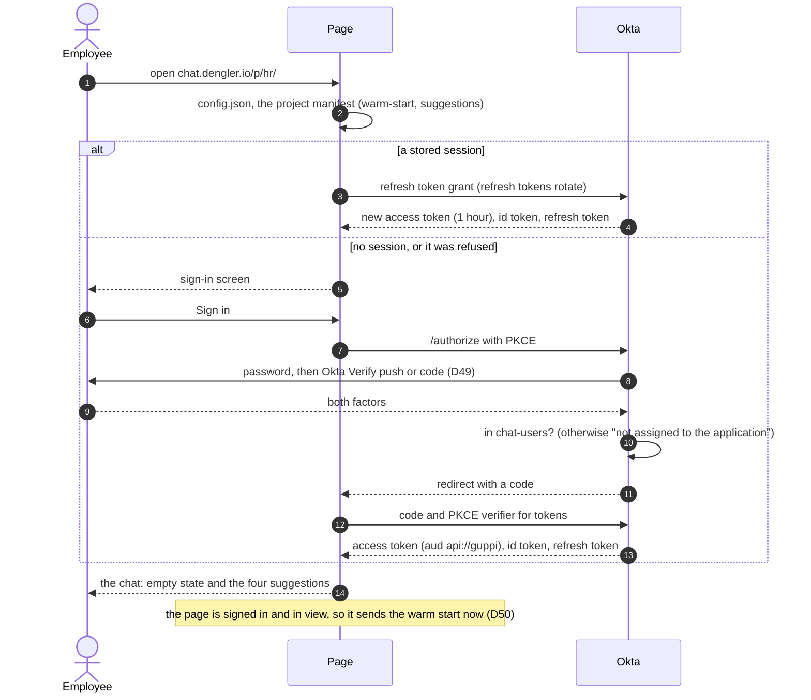
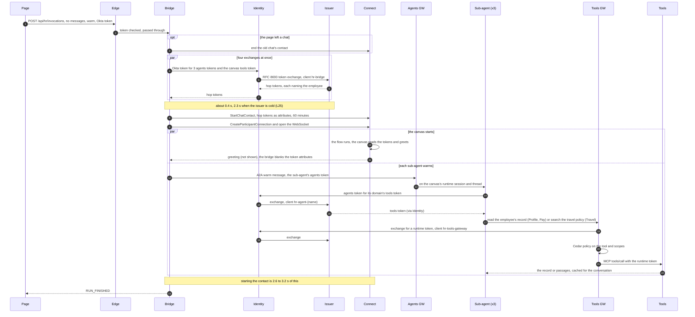
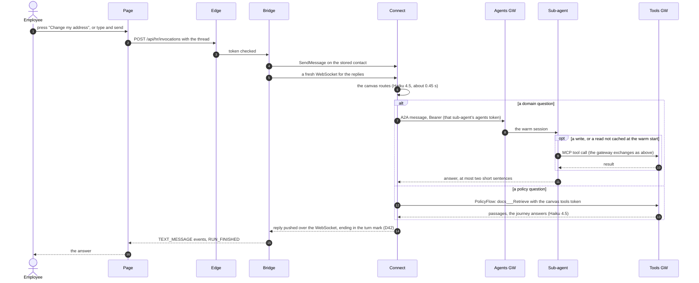

# Sign-in to first answer on /p/hr/

How an employee gets from the sign-in screen to an answer on `chat.dengler.io/p/hr/`, the
Connect project (D39 to D50). Three stages: sign-in and page load, the warm start the page
sends for each new chat, and a question. Times are from the harness and the logs of
4 October 2026 (L23, L24); the decisions are in [decision-log.md](decision-log.md).

Who is who in the diagrams:

| Name | What it is |
| --- | --- |
| Page | guppi-gpt's page with this project's manifest (`connect/web/manifest.json`), `web/src/app.js` |
| Okta | The Okta org: the app `chat.dengler.io`, its sign-in policy (D49), the authorization server `guppi` (audience `api://guppi`, members of `chat-users` only) |
| Edge | CloudFront and the platform's edge gateway (AWS WAF, per-user limits, JWT check) |
| Bridge | AgentCore Runtime `guppi_connect_bridge`: one AG-UI run as one Connect chat turn (`connect/agent/src/connect_bridge/turn.py`) |
| Identity | AgentCore Identity: holds each client's secret and makes the RFC 8693 exchange (D47) |
| Issuer | guppi-gpt's token issuer: API Gateway and the Lambda `guppi-gpt-obo-issuer` |
| Connect | The chat contact, its contact flow and the Agentic CX canvas (`connect/acxd/hr.js`) |
| Agents GW | AgentCore Gateway `hr-super-agent-agents`, one target per sub-agent |
| Sub-agent | AgentCore Runtime `hr_super_agent_{profile,pay,travel}`, Haiku 4.5, A2A |
| Tools GW | AgentCore Gateway `hr-super-agent-tools` with its Cedar policy engine |
| Tools | AgentCore Runtime `hr_super_agent_tools` (MCP) over the DynamoDB tables |

## Sign-in and page load

The page keeps a session (refresh token) in the browser. With one, a load refreshes it
silently and shows the chat; without one, the employee signs in through Okta.

## Warm start

For each new chat the page posts a run with no messages and `forwardedProps.warm`. It goes
out as soon as the signed-in page is in view: at load, at sign-in, on New chat, or when a
hidden tab comes into view; a chat still empty 50 minutes later is warmed again when the
employee comes back (D50, guppi-gpt `warmDue`). It takes 6.4 to 8.4 s, all of it before
the employee asks anything.

## A question

A suggestion press or a typed question after the warm start finds the contact, the
sub-agent sessions and the record ready. First words in 1.3 to 5.0 s, depending on the
question (L24). A question sent while the warm start is still running waits for its end;
under D44 a suggestion press always did, at 8.5 s median.

